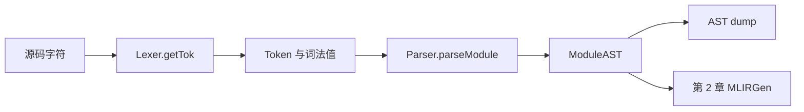
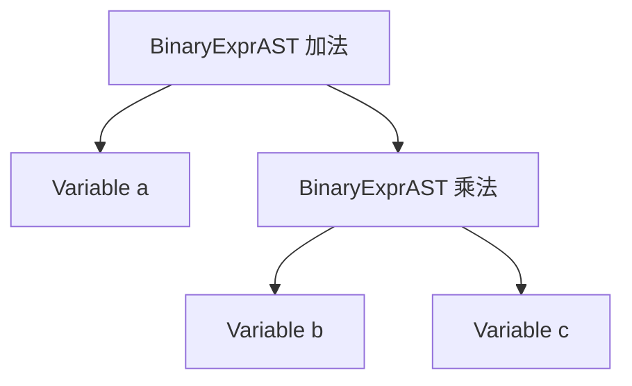

# 第 1 章：Toy 语言与 AST（扩充教材）

本地原文：[Ch-1.md](/opt/llvm-project/mlir/docs/Tutorials/Toy/Ch-1.md) · [本章源码](/opt/llvm-project/mlir/examples/toy/Ch1/toyc.cpp)

基准：`release/18.x` / `3b5b5c1ec4a3`。正文按官方主线译编；原文与实现不一致处，以本地代码校正并说明。C++、TableGen 与 MLIR 代码块分别标为“逐字源码”“译编”或“示意”；只有带源码锚点的逐字摘录参与逐行核对，完整实现见源码链接。

本章先定义教程要编译的语言，再观察词法分析器和递归下降解析器产生的抽象语法树（AST）。下一章才会进入 MLIR。

## 1. Toy 语言

Toy 是一门基于张量的小型语言，可以定义函数、执行简单数学运算并打印结果。为了聚焦 MLIR，语言有意受到限制：

- 官方把教学代码生成目标限定为秩不超过 2 的张量；源码中的递归字面量解析与部分循环生成更一般，并非每层都检查这个上限；
- 唯一的数据元素类型是 64 位浮点数，即 C/C++ 的 `double`；
- 所有值都不可变，每个操作产生一个新值；
- 源程序不显式释放内存；第 5 章由编译器插入 `memref.alloc/dealloc`，第 6 章继续降低到分配/释放调用；
- 内建函数只有 `transpose` 和 `print`。

下面是第一个 Toy 程序：

```toy
def main() {
  # a 的形状由字面量推断为 <2, 3>
  var a = [[1, 2, 3], [4, 5, 6]];

  # 显式声明形状；元素总数相同时，字面量会被重塑
  var b<2, 3> = [1, 2, 3, 4, 5, 6];

  # 先转置，再逐元素相乘，最后打印
  print(transpose(a) * transpose(b));
}
```

Toy 通过类型推断执行静态类型检查。只有在需要说明张量形状时才写类型信息。函数是泛型的：形参最初只知道是张量，并不知道具体维度。原文用“按调用签名专门化”描述期望行为，但本地第 4 章实际采用内联加函数内形状传播，没有实现缓存专门化版本的机制。下例关于专门化的注释描述原文的语言设想，不能当作 Ch1 已具备的功能。

```toy
def multiply_transpose(a, b) {
  return transpose(a) * transpose(b);
}

def main() {
  var a = [[1, 2, 3], [4, 5, 6]];
  var b<2, 3> = [1, 2, 3, 4, 5, 6];

  # 第一次以 <2,3>、<2,3> 调用，结果为 <3,2>
  var c = multiply_transpose(a, b);
  # 签名相同，复用已有专门化版本
  var d = multiply_transpose(b, a);
  # 以新的 <3,2>、<3,2> 签名调用，产生新专门化版本
  var e = multiply_transpose(c, d);
  # 原文设想：不兼容 shape 应报错；本地实现未完整检查这一情形
  var f = multiply_transpose(a, c);
}
```

这里最重要的事实是：源程序不仅包含“加、乘、转置”这些计算，还包含函数、变量声明、返回语句、形状与源码位置。前端首先要把这些结构保存为 AST。

## 2. AST

AST 忽略括号、分号等语法表面细节，只保留程序的结构与语义关系。上例的 AST 可概括为：

```text
Module
├── Function multiply_transpose(a, b)
│   └── Return
│       └── Binary *
│           ├── Call transpose → Variable a
│           └── Call transpose → Variable b
└── Function main()
    ├── VarDecl a → TensorLiteral <2,3>
    ├── VarDecl b<2,3> → TensorLiteral <6>
    ├── VarDecl c → Call multiply_transpose(a,b)
    ├── VarDecl d → Call multiply_transpose(b,a)
    ├── VarDecl e → Call multiply_transpose(c,d)
    └── VarDecl f → Call multiply_transpose(a,c)
```

真实 AST dump 还会在节点后记录类似 `file.toy:5:25` 的源码位置。诊断信息和后续 MLIR 的 `Location` 都会依赖这些位置。

## 3. 运行本章示例

构建 LLVM/MLIR 与 Toy 示例后，先按 [环境准备](../aiversion/00-preflight.md) 设置 `TOY_BUILD`，然后运行：

```bash
${TOY_BUILD}/bin/toyc-ch1 \
  /opt/llvm-project/mlir/test/Examples/Toy/Ch1/ast.toy \
  -emit=ast
```

路径会随构建布局不同而变化。官方源码中的关键文件是：

- `mlir/examples/toy/Ch1/include/toy/Lexer.h`：词法分析器；
- `mlir/examples/toy/Ch1/include/toy/Parser.h`：递归下降解析器；
- `mlir/examples/toy/Ch1/include/toy/AST.h`：AST 数据结构；
- `mlir/examples/toy/Ch1/toyc.cpp`：驱动程序。

解析器与 LLVM Kaleidoscope 教程前两章采用相近的方法。Toy 教程不把重点放在解析器实现，而把 AST 作为进入 MLIR 的输入。

## 4. 本章结论

编译器前端完成了这条路径：

```text
Toy 源码 → Token → AST
```

下一章将把 AST 映射为一种保留 Toy 高层语义的 MLIR 方言。

## 5. 对照本地解析器理解语言边界

[Lexer.h](/opt/llvm-project/mlir/examples/toy/Ch1/include/toy/Lexer.h) 用负数枚举表示 `def`、`var`、`return`、标识符和数字，单字符标点直接返回字符值。`print` 与 `transpose` 都不是词法关键字：`print` 在 Parser 中识别成 `PrintExprAST`，`transpose` 保持 `CallExprAST`，到 MLIRGen 才分派为专门的操作。

[Parser.h](/opt/llvm-project/mlir/examples/toy/Ch1/include/toy/Parser.h) 的 `parseTensorLiteralExpr()` 递归收集元素，当前维长度取列表大小，再附加子字面量维度，并尝试检查子数组形状一致。`parseBinOpRHS()` 处理操作符优先级：`+`、`-` 为 20，`*` 为 40。然而 Ch2 的 MLIRGen 只实现 `+` 和 `*`；Parser 接受 `-` 不等于完整编译链支持减法。

[AST.h](/opt/llvm-project/mlir/examples/toy/Ch1/include/toy/AST.h) 的所有表达式继承 ExprAST，保存 kind 与 Location；子节点由 `std::unique_ptr` 拥有。PrototypeAST 保存函数名、参数名和位置，FunctionAST 拥有 prototype 与 body，ModuleAST 保存函数列表。节点的 `classof` 提供 LLVM 风格 RTTI，供 `isa/dyn_cast/cast` 使用。

本章命令仅做语法分析和 AST dump，不解析未声明变量，也不对函数做专门化。原文最后的错误形状示例表达了语言期望；本地 Add/Mul 的形状推断只是复制左输入类型，所以不能把“给出不同形状一定在此阶段得到友好诊断”当作代码保证。

`var b<2,3>` 的 `<2,3>` 是变量声明的重塑要求；AST 中初始化器 `[1,2,3,4,5,6]` 仍是形状 `<6>` 的 Literal。两者并存，正好为第 2 章显式插入 `toy.reshape` 提供依据。

## 6. 编译器前端基础：从字符到可遍历的对象

程序最初只是字符序列。编译器不能直接对字符做“交换两个维度”这样的操作，它先要识别词，再建立语法结构，最后才讨论意义。下面的分工图对应本地三个头文件，而不是一个抽象的理想编译器。



Lexer 每次返回一个 Token，同时在成员中保存当前标识符字符串或数字值。Parser 通过 `getCurToken()` 看当前 Token，通过 `getNextToken()` 前进；`consume(expected)` 先断言当前种类正确，再前进。它没有把所有 Token 先存成一个大数组，前瞻主要依赖当前 Token 和词法器已经读到的一个字符。

假设输入为 `var y = transpose(x);`：读到 `var` 返回 `tok_var`；读到 `y` 返回 `tok_identifier`，`getId()` 才能得到 `"y"`。所以 Token 种类回答“它是什么类别”，附加值回答“具体叫什么”。解析器保存变量名时应复制必要字符串，因为词法器的当前标识符成员会被下一个 Token 更新。

### 6.1 关键词、内建函数和用户函数

`def`、`var`、`return` 在词法阶段区分。`transpose` 和 `print` 从 Lexer 看只是名字，这允许 Parser 复用一般调用语法：先读 callee，再读逗号分隔的实参列表。之后它把恰好一个实参的 `print(...)` 包装为 `PrintExprAST`；`transpose(...)` 留给后续生成器处理。

区分这两个阶段很有用：如果想给语言增加内建 `sum`，不一定要先修改 Lexer。只要沿用函数调用语法，就可以先在 MLIRGen 的 callee 分派处识别它，当然还需增加操作、类型规则和后续转换。

## 7. 张量的秩、形状、元素类型与运算

张量可以先理解成具有规则维度的数字集合。秩是轴的数量；形状是每条轴的长度；元素类型说明一个位置存什么。`[[1,2,3],[4,5,6]]` 的 rank 为 2，shape 为 `[2,3]`，元素为 f64。一个 `5.5` 在 Toy IR 中是 rank 0 的张量，而不是“没有类型的数字”。

| 形式 | 秩 | 形状 | 元素数量 |
|---|---:|---|---:|
| `5.5` | 0 | `[]` | 1 |
| `[1,2,3]` | 1 | `[3]` | 3 |
| `[[1,2,3],[4,5,6]]` | 2 | `[2,3]` | 6 |

### 7.1 reshape 和 transpose 是不同运算

行优先展开后，原矩阵的数据顺序为 `[1,2,3,4,5,6]`。reshape 为 3×2 时依次装入新形状，得到 `[[1,2],[3,4],[5,6]]`；转置则改变索引映射，得到 `[[1,4],[2,5],[3,6]]`。

```text
原矩阵 A（2×3）       reshape(A,3×2)       transpose(A)
1 2 3                 1 2                 1 4
4 5 6                 3 4                 2 5
                      5 6                 3 6
```

Toy 的 `*` 是逐元素乘法。转置后的两个相同矩阵相乘，结果是 `[[1,16],[4,25],[9,36]]`。它不是线性代数中的矩阵乘法；`LowerToAffineLoops.cpp` 某些注释出现 matmul，不应据此给语言添加并不存在的矩阵乘语义。

### 7.2 Parser 如何知道字面量形状

解析 `[[1,2,3],[4,5,6]]` 时，内层两次递归各返回一个 `LiteralExprAST`，其 dims 为 `[3]`。外层先记录元素数 2，再接上首个子节点的 `[3]`，得到 `[2,3]`，并检查其他子节点的维度是否一致。

对 `[[1,2],[3,4,5]]`，两个子节点分别给出 `[2]`、`[3]`，无法构成规则张量。本地 Parser 有维度检查，但不是完整健壮的语法验证器，例如部分混合嵌套路径使用 `cast` 而非安全的 `dyn_cast`。学习时要分清“代码意图是拒绝不规则数据”和“所有坏输入都能得到理想错误消息”。

## 8. 递归下降与操作符优先级：一步步解析表达式

`parseExpression()` 先用 `parsePrimary()` 取得左边基本表达式，再用 `parseBinOpRHS(0, lhs)` 处理右边操作符。基本表达式可以是数值、变量/调用、括号表达式、张量字面量。递归来自括号、实参和嵌套字面量，并非所有语法结构都需要特殊解析机制。

以 `a + b * c` 为例：先读 a，当前 `+` 的优先级 20；读取 b 后发现后面的 `*` 优先级 40 更高，于是递归先构造 `b*c`，然后再构造 `a+(b*c)`。



若写 `(a+b)*c`，`parseParenExpr()` 先完整解析括号中的加法，再把它作为外层乘法的左孩子。括号本身通常不需要独立 AST 节点，树的形状已经记住优先级。

## 9. AST 的所有权、身份与源码位置

`unique_ptr` 表示父节点独占子节点，树销毁时自动递归释放。遍历函数得到的 `ExprAST*` 或引用通常只是借用，不拥有对象，不能比 AST 活得更久。`ArrayRef` 则是“指针加长度”的只读视图，不复制底层容器。理解这两点，可以避免把教材中的 C++ 当作无需关心生命周期的脚本。

`ExprASTKind` 和每个派生类的 `classof()` 让 LLVM 的 `isa` 检查类别、`dyn_cast` 在不匹配时返回空指针、`cast` 在假设不成立时断言。Parser 构造确定类型的节点；MLIRGen 依据 kind 分派，再使用 cast 取出相应字段。

`Location` 含文件名、行、列。文件名由 shared_ptr 共享，避免每个节点重复存储长字符串。到了第 2 章，它变成 `FileLineColLoc`；以后一个高层操作展开为几十个循环和 load/store，仍可以把同一个来源位置附给它们。

## 10. 贯穿实例：一次声明在各层的身份

对 `var b<2,3> = [1,2,3,4,5,6];`，不要把“b 的声明类型”和“字面量自己的形状”提前合并。AST 的 VarDecl 有 shape `[2,3]`，其 initializer Literal 的 dims 为 `[6]`。生成器首先创建 6 元素张量常量，再创建结果为 2×3 的 reshape，最后把变量名 b 映射到 reshape 结果。第 3 章才把 reshape 折进常量。

这种逐步保存信息的策略，使解析器无需理解所有优化，也使后续优化能独立验证。

## 11. 例题与解析

**例题一：把 `a*b` 改成 `transpose(a*b)`，AST 增加什么？**

增加一个 CallExprAST，它的唯一实参是原 BinaryExprAST；不是给 a、b 各加一个转置。形状和数值语义由后续操作决定。

**例题二：`toyc-ch1 -emit=ast` 能发现未定义变量吗？**

不能依赖它完成这件事。Ch1 Parser 保存变量名，不做符号解析。第 2 章 MLIRGen 在作用域表中查找失败，才有机会报 unknown variable。

**例题三：Parser 支持减号，为什么编译失败？**

语法接受范围和代码生成支持范围不同。本地 precedence 表含 `-`，但 MLIRGen 的 switch 只映射 `+` 与 `*`。新增语言特性需要贯通后续各层。

**例题四：给函数参数设成 `tensor<*xf64>`，是否表示空张量？**

不是。星号表示秩信息尚未知；数据本身可以有多个维度。空张量是某个已知维度为 0，属于另一种情况。

<a id="code-lab"></a>

## 12. 关键代码与实验：顺着入口看 AST 如何长出来

先确认第 0 章的 TOY_BUILD 与 TOY_LAB 已设置。本章只读两个代码位置：文件如何交给 Parser，以及优先级如何改变树形；Lexer 和每个 AST 类的完整定义无需全部抄入教材。

### 12.1 从文件内容进入 Parser

> 代码性质：逐字源码（按所引路径与起始行核对；不等于独立可编译）。

[源码：Ch1/toyc.cpp](/opt/llvm-project/mlir/examples/toy/Ch1/toyc.cpp:42)

```c++
std::unique_ptr<toy::ModuleAST> parseInputFile(llvm::StringRef filename) {
  llvm::ErrorOr<std::unique_ptr<llvm::MemoryBuffer>> fileOrErr =
      llvm::MemoryBuffer::getFileOrSTDIN(filename);
  if (std::error_code ec = fileOrErr.getError()) {
    llvm::errs() << "Could not open input file: " << ec.message() << "\n";
    return nullptr;
  }
  auto buffer = fileOrErr.get()->getBuffer();
  LexerBuffer lexer(buffer.begin(), buffer.end(), std::string(filename));
  Parser parser(lexer);
  return parser.parseModule();
}
```

依次读这段代码：

1. `getFileOrSTDIN` 取得输入缓冲区；打不开文件时返回空指针，不进入语法分析。
2. `getBuffer()` 取得字符视图；LexerBuffer 使用 begin/end 读取字符，并带上文件名以产生位置。
3. Parser 持有对词法器的引用；`parseModule()` 驱动解析，而不是 Lexer 主动决定整个程序的语法。
4. 返回的是拥有 AST 的 unique_ptr。局部输入缓冲区离开此函数后，AST 应持有所需的名字、数值与位置，而不能继续借用临时 token 文本。

因此报错为“Could not open input file”时，根本还没走到 parseExpression；不要从运算符优先级查起。

### 12.2 真正决定乘法先结合的几行

下面只摘出 parseBinOpRHS 的后半段；循环和函数外壳见源码：

> 代码性质：逐字源码（按所引路径与起始行核对；不等于独立可编译）。

[源码：Ch1/include/toy/Parser.h](/opt/llvm-project/mlir/examples/toy/Ch1/include/toy/Parser.h:267)

```c++
      int nextPrec = getTokPrecedence();
      if (tokPrec < nextPrec) {
        rhs = parseBinOpRHS(tokPrec + 1, std::move(rhs));
        if (!rhs)
          return nullptr;
      }

      // Merge lhs/RHS.
      lhs = std::make_unique<BinaryExprAST>(std::move(loc), binOp,
                                            std::move(lhs), std::move(rhs));
```

读 `a + b * c` 时，当前 tokPrec 对应 +，rhs 暂时只有 b；发现后面 * 的 nextPrec 更高，就以 b 为左侧递归构造 b*c。然后外层才创建 `BinaryExprAST('+', a, b*c)`。`std::move` 把已有子树的所有权交给新节点，不是复制一份大树。

这段代码同时说明：括号可以通过递归改变组合顺序，而树里不必保留一个专门的“左括号对象”。

### 12.3 打印 AST，并区分声明形状与字面量形状

```bash
cmake --build "$TOY_BUILD" --target toyc-ch1 FileCheck --parallel 2
"$TOY_BUILD/bin/toyc-ch1" \
  /opt/llvm-project/mlir/test/Examples/Toy/Ch1/ast.toy \
  -emit=ast 2> "$TOY_LAB/ch1-ast.txt"
rg -n 'Proto|VarDecl|Literal|BinOp|Call|Return' "$TOY_LAB/ch1-ast.txt"
```

观察 `b<2,3>`：VarDecl 上有声明 shape，而初始化器 Literal 仍是一维六元素。此时未产生 reshape 操作，也没有执行乘法；这些信息会在下一章交给 MLIRGen。

可让官方测试检查其 AST 输出结构：

```bash
set -o pipefail
"$TOY_BUILD/bin/toyc-ch1" \
  /opt/llvm-project/mlir/test/Examples/Toy/Ch1/ast.toy -emit=ast 2>&1 \
  | "$TOY_BUILD/bin/FileCheck" /opt/llvm-project/mlir/test/Examples/Toy/Ch1/ast.toy
```

若只想改一个表达式观察树形，先复制输入，不动上游：

```bash
cp /opt/llvm-project/mlir/test/Examples/Toy/Ch1/ast.toy "$TOY_LAB/ch1-edit.toy"
```

用编辑器把 multiply_transpose 的返回表达式改成 `a + a * b`，再以 -emit=ast 运行副本；预期为加法在外、乘法在右子树。修改后不要继续沿用原文件的 FileCheck 预期，因为输入语义已经变了。这个实验只验证语法结构，不要求这组输入先通过形状检查。
