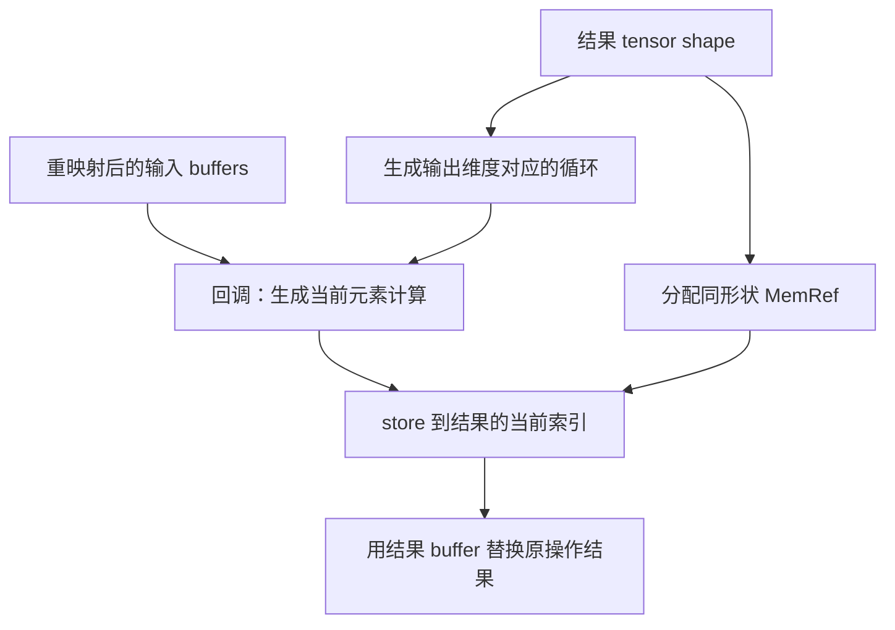

# 第 5 章：部分降级到低层方言以便优化（扩充教材）

本地原文：[Ch-5.md](/opt/llvm-project/mlir/docs/Tutorials/Toy/Ch-5.md) · [本章源码](/opt/llvm-project/mlir/examples/toy/Ch5/toyc.cpp)

基准：`release/18.x` / `3b5b5c1ec4a3`。正文按官方主线译编；原文与实现不一致处，以本地代码校正并说明。C++、TableGen 与 MLIR 代码块分别标为“逐字源码”“译编”或“示意”；只有带源码锚点的逐字摘录参与逐行核对，完整实现见源码链接。

本章展示 MLIR 的渐进式降级：计算密集的 Toy 操作先降到 Affine、Arith、Func 与 MemRef 方言；暂时保留 `toy.print`，留待下一章处理。

## 1. Tensor 与 MemRef

`TensorType` 表示抽象的值语义数据，没有可见的存储位置；`MemRefType` 是对内存区域的引用，可被 load/store 索引。降级会把：

```text
toy.transpose / toy.mul + tensor
            ↓
affine.for + affine.load/store + arith.mulf + memref
```

这一步显式引入缓冲区分配、循环、索引与读写。

## 2. Dialect Conversion 三要素

转换框架把非法操作改写为合法操作，需要：

- Conversion Target：定义转换完成后哪些操作合法；
- Conversion Patterns：把非法操作改写为合法操作；
- Type Converter（可选）：为转换定义类型映射，可用于结果、操作数边界及块参数/函数签名的合法化；不是单靠它就会生成转换操作。

本章没有创建 `TypeConverter`：只用局部的 Tensor→MemRef 类型辅助函数及重映射机制，函数边界也限制为无参数、无返回值的 main。下一章才使用 `LLVMTypeConverter`，不能把上面的框架能力列表当成本章实现清单。

### 2.1 Conversion Target

> 代码性质：示意（非逐字源码，未编译或运行验证）。

```c++
ConversionTarget target(getContext());
target.addLegalDialect<affine::AffineDialect, BuiltinDialect,
                       arith::ArithDialect,
                       func::FuncDialect,
                       memref::MemRefDialect>();
target.addIllegalDialect<toy::ToyDialect>();

target.addDynamicallyLegalOp<toy::PrintOp>([](toy::PrintOp op) {
  return llvm::none_of(op->getOperandTypes(),
                       [](Type type) { return llvm::isa<TensorType>(type); });
});
```

Toy 方言整体非法，但 `toy.print` 在输入不再是 Tensor 时动态合法。单个操作规则优先于方言规则，书写顺序不影响结论。

### 2.2 Conversion Pattern

转换 pattern 获得已经转换/重映射的操作数。本地转置继承 `ConversionPattern`，在回调中手工构造生成的 `TransposeOpAdaptor` 以使用命名访问器；`OpConversionPattern` 则提供类型化 adaptor 参数。降低转置时，生成输出循环，并反转索引读取输入：

> 代码性质：逐字源码（按所引路径与起始行核对；不等于独立可编译）。

[源码：Ch5/mlir/LowerToAffineLoops.cpp](/opt/llvm-project/mlir/examples/toy/Ch5/mlir/LowerToAffineLoops.cpp:293)

```c++
struct TransposeOpLowering : public ConversionPattern {
  TransposeOpLowering(MLIRContext *ctx)
      : ConversionPattern(toy::TransposeOp::getOperationName(), 1, ctx) {}

  LogicalResult
  matchAndRewrite(Operation *op, ArrayRef<Value> operands,
                  ConversionPatternRewriter &rewriter) const final {
    auto loc = op->getLoc();
    lowerOpToLoops(op, operands, rewriter,
                   [loc](OpBuilder &builder, ValueRange memRefOperands,
                         ValueRange loopIvs) {
                     // Generate an adaptor for the remapped operands of the
                     // TransposeOp. This allows for using the nice named
                     // accessors that are generated by the ODS.
                     toy::TransposeOpAdaptor transposeAdaptor(memRefOperands);
                     Value input = transposeAdaptor.getInput();

                     // Transpose the elements by generating a load from the
                     // reverse indices.
                     SmallVector<Value, 2> reverseIvs(llvm::reverse(loopIvs));
                     return builder.create<affine::AffineLoadOp>(loc, input,
                                                                 reverseIvs);
                   });
    return success();
  }
};
```

相同的循环生成辅助函数可被 transpose、mul 等 lowering 复用。

## 3. 部分转换

准备好 target 与 patterns 后执行：

> 代码性质：示意（非逐字源码，未编译或运行验证）。

```c++
RewritePatternSet patterns(&getContext());
patterns.add<AddOpLowering, ConstantOpLowering, FuncOpLowering,
             MulOpLowering, PrintOpLowering, ReturnOpLowering,
             TransposeOpLowering>(&getContext());

if (failed(applyPartialConversion(getOperation(), target, std::move(patterns))))
  signalPassFailure();
```

只要仍有被声明为非法、且无法改写的操作，转换就失败。

## 4. 混合抽象层时的设计选择

`toy.print` 尚未降级，却必须消费从 Tensor 转成的 MemRef。官方讨论了三种桥接方案：

1. 从缓冲区 load 并重新物化 Tensor：保持原 `print` 定义，但可能隐藏一次完整拷贝；
2. 新增一个接收 MemRef 的低层 `print`：抽象清晰，但产生重复操作定义；
3. 扩展原 `toy.print`，让它同时接收 Tensor 与 MemRef：实现最简单、无隐藏拷贝，但一个操作混合了抽象层。

教程选择第三种：

> 代码性质：示意（非逐字源码，未编译或运行验证）。

```tablegen
let arguments = (ins AnyTypeOf<[F64Tensor, F64MemRef]>:$input);
```

这是为了教学简洁做出的工程取舍，并不是所有生产编译器的最佳设计。

## 5. 转换结果

高层：

> 代码性质：示意（非逐字源码，未编译或运行验证）。

```mlir
%0 = toy.constant dense<[[1.0, 2.0], [3.0, 4.0]]> : tensor<2x2xf64>
%1 = toy.transpose(%0 : tensor<2x2xf64>) to tensor<2x2xf64>
%2 = toy.mul %1, %1 : tensor<2x2xf64>
toy.print %2 : tensor<2x2xf64>
```

经过部分降级及循环融合/标量替换后，核心结构可示意为（省略输入初始化、函数外壳和释放，不能独立执行）：

> 代码性质：示意（非逐字源码，未编译或运行验证）。

```mlir
%input = memref.alloc() : memref<2x2xf64>
%output = memref.alloc() : memref<2x2xf64>
affine.for %i = 0 to 2 {
  affine.for %j = 0 to 2 {
    %v = affine.load %input[%j, %i] : memref<2x2xf64>
    %r = arith.mulf %v, %v : f64
    affine.store %r, %output[%i, %j] : memref<2x2xf64>
  }
}
toy.print %output : memref<2x2xf64>
```

## 6. 复用 Affine 优化

朴素 lowering 会产生临时缓冲区、多个循环巢和重复 load。把现成的循环融合与 affine scalar replacement 等 pass 加入流水线后，可以：

- 合并转置与乘法循环；
- 删除中间分配；
- 转发已知标量，消除多余 load；
- 保留更紧凑的单个循环巢。

```bash
${TOY_BUILD}/bin/toyc-ch5 \
  /opt/llvm-project/mlir/test/Examples/Toy/Ch5/affine-lowering.mlir \
  -emit=mlir-affine -opt
```

本章的关键不是手写循环，而是把高层语义降到一个已经拥有成熟优化的可复用方言。

## 7. 循环生成和内存管理的完整连接

前面的转置 pattern 使用同一个 `lowerOpToLoops` 辅助函数：

> 代码性质：逐字源码（按所引路径与起始行核对；不等于独立可编译）。

[源码：Ch5/mlir/LowerToAffineLoops.cpp](/opt/llvm-project/mlir/examples/toy/Ch5/mlir/LowerToAffineLoops.cpp:80)

```c++
static void lowerOpToLoops(Operation *op, ValueRange operands,
                           PatternRewriter &rewriter,
                           LoopIterationFn processIteration) {
  auto tensorType = llvm::cast<RankedTensorType>((*op->result_type_begin()));
  auto loc = op->getLoc();

  // Insert an allocation and deallocation for the result of this operation.
  auto memRefType = convertTensorToMemRef(tensorType);
  auto alloc = insertAllocAndDealloc(memRefType, loc, rewriter);

  // Create a nest of affine loops, with one loop per dimension of the shape.
  // The buildAffineLoopNest function takes a callback that is used to construct
  // the body of the innermost loop given a builder, a location and a range of
  // loop induction variables.
  SmallVector<int64_t, 4> lowerBounds(tensorType.getRank(), /*Value=*/0);
  SmallVector<int64_t, 4> steps(tensorType.getRank(), /*Value=*/1);
  affine::buildAffineLoopNest(
      rewriter, loc, lowerBounds, tensorType.getShape(), steps,
      [&](OpBuilder &nestedBuilder, Location loc, ValueRange ivs) {
        // Call the processing function with the rewriter, the memref operands,
        // and the loop induction variables. This function will return the value
        // to store at the current index.
        Value valueToStore = processIteration(nestedBuilder, operands, ivs);
        nestedBuilder.create<affine::AffineStoreOp>(loc, valueToStore, alloc,
                                                    ivs);
      });

  // Replace this operation with the generated alloc.
  rewriter.replaceOp(op, alloc);
}
```

注意回调的三个参数是 builder、**重映射后的 memRefOperands**、loopIvs。本地 BinaryOpLowering 和 TransposeOpLowering 都依赖第二个参数取得正确输入；本地英文原文的转置示例同样给出了这三个参数。输出 buffer 由结果类型分配，每次迭代产生一个 f64，统一存到输出索引。

> 代码性质：逐字源码（按所引路径与起始行核对；不等于独立可编译）。

[源码：Ch5/mlir/LowerToAffineLoops.cpp](/opt/llvm-project/mlir/examples/toy/Ch5/mlir/LowerToAffineLoops.cpp:57)

```c++
static Value insertAllocAndDealloc(MemRefType type, Location loc,
                                   PatternRewriter &rewriter) {
  auto alloc = rewriter.create<memref::AllocOp>(loc, type);

  // Make sure to allocate at the beginning of the block.
  auto *parentBlock = alloc->getBlock();
  alloc->moveBefore(&parentBlock->front());

  // Make sure to deallocate this alloc at the end of the block. This is fine
  // as toy functions have no control flow.
  auto dealloc = rewriter.create<memref::DeallocOp>(loc, alloc);
  dealloc->moveBefore(&parentBlock->back());
  return alloc;
}
```

alloc 被移到所在块开头，dealloc 被移到终结操作之前。这依赖 Toy 没有复杂控制流、返回的 main 无结果、缓冲区不逃逸的条件；不能推广成所有 CFG 中安全的通用释放算法。

常量 lowering 用编译器里的递归函数枚举所有元素，为每个元素生成常量和 store；这里的递归发生在编译期。Add/Mul 共享 `BinaryOpLowering<BinaryOp, LoweredBinaryOp>` 模板；常量转换继承 `OpRewritePattern`，转置和二元操作继承 `ConversionPattern`，Func/Print 使用 `OpConversionPattern`，没有要求所有模式都必须继承同一具体模板。

### 7.1 函数边界与 Print 原地更新

FuncOpLowering 只接受名为 `main` 且无实参、无结果的 Toy 函数；创建 `mlir::func::FuncOp`，通过 `inlineRegionBefore` 移入原 Region，最后删除旧函数。ReturnOpLowering 只接受无操作数的 return。

PrintOpLowering 虽然保留 `toy.print`，仍调用 `rewriter.modifyOpInPlace` 将 operands 换成 adaptor 中的 MemRef 值。只标记 print 动态合法而不更新它的输入，会让转换停在不满足条件的状态。

### 7.2 转换前必须满足的条件

注册的七种 lowering 为 Add、Constant、Func、Mul、Print、Return、Transpose。没有 GenericCall、Cast、Reshape 的 lowering。常见测试依赖前面的内联、shape inference 和 canonicalization 消除这些操作；如果真正的非恒等运行时 reshape 留下，转换会失败。

此外，常量初始化使用静态 shape 枚举，循环边界也直接取静态维度。仅知道 rank、不知道 size 的输入不能据此自动获得完整动态形状支持。

## 8. 从值语义到存储语义：究竟改变了什么

前四章中的张量是一个数学上的值。写出 `%b = toy.transpose(%a ...)`，表示得到一个新的结果；IR 尚未要求你决定它位于栈、堆还是寄存器，也没有暴露可以写入某个元素的接口。“不可变”指源语言的值不能被原地修改，不代表编译后必须永远为每一个中间结果保留一次独立内存分配。

MemRef 则把存储暴露出来。一个 `memref<3x2xf64>` 值是对缓冲区的引用，不是把六个浮点数直接装进一个 SSA 寄存器。引用本身是 SSA 值，所指内存却可以被 store 改变。因此同一个 `%buf` 在两次 load 之间没有重新定义，load 仍可能得到不同结果。这是第一次阅读低层 IR 时最重要的语义变化。

| 观察对象 | Tensor 阶段 | MemRef 阶段 |
|---|---|---|
| 一次加法 | 一个返回新张量的操作 | 循环中 load、标量加法、store |
| 转置 | 一个有明确数学含义的操作 | 从反向索引读取，向结果索引写入 |
| 中间结果 | 抽象的 SSA 值 | 显式缓冲区及其生命周期 |
| 可以分析的关系 | 高层操作的代数关系 | 循环依赖、访问位置、读写顺序 |
| 必须承担的责任 | 类型和形状正确 | 额外保证索引、初始化、内存释放正确 |

这里的 `convertTensorToMemRef` 只是根据 shape 和 element type 构造一个类型；真正让“值变成缓冲区”的是创建 alloc、生成计算、用 alloc 的 SSA 结果替换原结果这一组操作。只修改 Type 不会自动产生正确的内存程序。

## 9. 用非方阵逐项推导 transpose lowering

考虑输入：

```text
A，shape = 2×3       T = transpose(A)，shape = 3×2
1 2 3               1 4
4 5 6               2 5
                    3 6
```

我们采用“遍历输出”的策略。输出索引是 `(i,j)`，范围分别为 `0 <= i < 3`、`0 <= j < 2`。因为 `T[i,j] = A[j,i]`，每次迭代应当从输入反转后的索引 load，再向输出原索引 store。

下面是循环核心示意，假设 `%a` 已完成初始化、`%t` 已分配，故不是独立可执行文件：

> 代码性质：示意（非逐字源码，未编译或运行验证）。

```mlir
affine.for %i = 0 to 3 {
  affine.for %j = 0 to 2 {
    %x = affine.load %a[%j, %i] : memref<2x3xf64>
    affine.store %x, %t[%i, %j] : memref<3x2xf64>
  }
}
```

以最后一次迭代 `i=2,j=1` 为例，读取 `A[1,2]=6`，写入 `T[2,1]`。输入的第一维始终使用输出的第二个索引，才不会超出输入只有两行的范围。若错误地读取 `A[i,j]`，在方阵上可能只表现为“忘记转置”，在非方阵上则可能直接越界；这就是用非方阵设计测试的价值。

本地 `lowerOpToLoops` 不知道 transpose 的含义。它只根据结果 shape 产生三个外层责任：分配结果、生成循环、保存回调返回的元素。Transpose 的回调负责“怎样算出这个元素”；Mul 的回调负责从两个输入的相同位置 load，再返回 `arith.mulf`。这不是运行时函数回调：这些 C++ 回调在**编译 Toy 程序时**执行，用于创建将来执行的 IR。



### 9.1 为什么这里使用 Affine

普通 for 循环能表示很多东西，但并非所有循环都容易分析。Affine 把常见的循环边界和下标关系表示为受限制的整数表达式。例如 `A[j,i]`、`A[i+1,j]` 中的关系能显式暴露给依赖分析；两个运行时循环变量相乘作为下标则不能简单视为普通仿射表达式。

不要把 Affine 简化为“只能使用常数下标”。它支持维度、符号以及受规则限制的运算；Toy 这里只使用最简单的静态上下界和索引置换。选择它，是因为这个教学子集自然落在可分析范围内，可以立即复用优化，而不是因为 MLIR 要求所有张量都经过 Affine。

## 10. Conversion 的合法性与重映射：两件不同的事

“合法”是本次转换的目标政策，不是这个操作永远正确或错误。`toy.transpose` 在 Toy 方言中当然是有效操作；在本章目标中却被明确禁止继续存在。反过来，把一个操作声明为合法也不会免除它自身的 verifier 检查。

Partial conversion 允许某些未被目标规定的操作留下，但**不允许明确 illegal 的操作留下**。因此它不是“能改多少算多少”。本地把整个 Toy 方言设为非法，再为满足条件的 Print 设置更具体的动态合法规则，表达的政策很精确：所有 Toy 计算必须消失，只有输入已变为 MemRef 的打印可以留下。

现在跟踪一条使用链：

```text
转换前：
  %a_tensor = toy.constant ...
  toy.print %a_tensor : tensor<2x3xf64>

常量 pattern 已记录结果替换：
  %a_tensor  →  %a_buffer

Print pattern 读取 adaptor 的输入并更新操作后：
  toy.print %a_buffer : memref<2x3xf64>
```

原操作上的输入和转换框架提供的重映射输入不是可以任意混用的两个名字。本章的 Print 必须更新输入，才符合目标的合法性条件；转置则需要用重映射后的 MemRef 构造 load。转换框架维护的替换关系把这些 pattern 连起来。

第 5 章没有建立一个全面的 `TypeConverter` 对象。它通过局部类型辅助函数和 conversion rewriter 完成受限场景；函数也只接受无参数、无返回值的 main。到了下一章，函数签名、循环块参数和 MemRef 描述符都涉及系统性类型变化，才使用 `LLVMTypeConverter`。不要从三要素列表推导出每个转换都必须手写一个 TypeConverter 子类。

## 11. 常量初始化、分配与释放为什么不能省略

`memref.alloc` 只分配内存，不会让里面自动出现原来的 tensor 常量。ConstantOpLowering 逐个取出 DenseElementsAttr 中的元素，创建浮点常量，再生成 store。它在 C++ 里递归遍历多维索引，因此常量越大，初始生成的 store 数量越多；这个教学实现并不是生产环境中处理大型模型权重的高效方案。

再看释放的位置。每个结果的 alloc 被移到当前块开头，dealloc 被移到块末 terminator 之前。对已经内联为单块、最终只打印结果的 main，这使分配支配后续使用，并把释放放在使用之后。若未来允许把缓冲区作为返回值交给调用方，照搬这一策略就会在返回之前释放它；若有分支和循环，还要考虑不同路径的所有权与释放次数。

因此“Toy 自动管理内存”的准确含义是：程序员不写 free，编译器在这个受限模型下生成分配和释放。它既不是垃圾收集器，也不是已经解决了完整别名分析、异常路径和所有权转移的通用内存管理系统。

### 11.1 reshape 为什么没有顺手变成循环

常量 reshape 可以把属性重新排成目标形状；恒等 reshape 可以被消掉。但改变非恒等形状的一般运行时 reshape 还可能涉及视图、布局与拷贝的选择。本章没有相应 lowering，不能因为“元素数一样”就假定它会自动变成 MemRef 视图。遇到转换失败时，应先确认前处理是否已经消除 reshape，而不是盲目给 target 添加“合法 Toy 方言”来掩盖缺失的后端实现。

## 12. 循环融合的收益来自哪里

假设程序先求 T=transpose(A)，再求 R=T*T。朴素 lowering 会先遍历 T 写一个中间 buffer，再遍历 R 两次读 T。把两个循环在依赖允许的情况下合并，就可以在同一次迭代里计算当前转置元素并立刻使用。进一步的标量替换能把中间的 store/load 变为 SSA 数据传递：

```text
未融合的一次数据流：
  load A → store T → load T、load T → multiply → store R

可以融合并标量替换时：
  load A → 一个 SSA 浮点值 → multiply(该值, 该值) → store R
```

但融合不是把两个相邻 for 的文本拼接。若第二个循环依赖第一个循环尚未计算的位置，或存在别名与副作用，改变顺序就可能改变结果。通用 pass 的价值在于利用依赖条件判断能否这样改。示例有望删除中间 T，但不能承诺所有输入和所有循环都被融合，也不能承诺每次 dump 的排列顺序完全相同。

可用已有工具比较同一个本地测试的两份 IR：

```bash
"${TOY_BUILD}/bin/toyc-ch5" /opt/llvm-project/mlir/test/Examples/Toy/Ch5/affine-lowering.mlir -emit=mlir-affine 2> affine-basic.mlir
"${TOY_BUILD}/bin/toyc-ch5" /opt/llvm-project/mlir/test/Examples/Toy/Ch5/affine-lowering.mlir -emit=mlir-affine -opt 2> affine-opt.mlir
diff -u affine-basic.mlir affine-opt.mlir
```

比较时先数 alloc、loop nest 和 load/store，再沿使用链解释变化。变量编号不同不构成语义差异；`diff` 返回 1 也只表示文件不同。

## 13. 带解析的练习

**问题一：** 结果类型是 `tensor<4x2xf64>`，转置输入应是什么 shape？循环边界是什么？

答：输入是 2×4，输出循环依次遍历 4 和 2，读取输入时使用 `[j,i]`。输出的 shape 决定循环空间，输入的访问映射决定 load 地址，二者不能交换。

**问题二：** Print 被标为动态合法，是否还需要 PrintOpLowering？

答：需要。动态合法性只检查当前状态，不替你把 tensor operand 改成对应的 MemRef。pattern 用 adaptor 提供的新输入原地更新操作，才能跨过这道边界。

**问题三：** 能否删除所有 dealloc 来让实验先跑通？

答：这可能让小程序表现正常，却引入内存泄漏，不是正确 lowering。应检查缓冲区的最后使用与所有权，而不是把资源正确性当作可选优化。

**问题四：** 输入是 `tensor<?x3xf64>`，已经有 rank 了，能否直接进入本章循环生成？

答：不能由 rank 已知推出静态 size 已知。这里的循环上界直接来自类型维度，动态维度的标记不是运行时维度值；实现没有为它生成查询和动态分配的完整路径。这也解释了第 4 章的简化 shape inference 与生产动态 shape 系统的距离。

<a id="code-lab"></a>

## 14. 关键代码与实验：从张量运算定位到一次 load/store

本章已有完整的 lowerOpToLoops 与转置 pattern，不再重抄循环外壳。下面选两个连接点：二元运算如何取得当前元素，以及保留下来的 Print 如何换成新输入。

### 14.1 二元运算的回调只负责一个元素

以下摘自 BinaryOpLowering 的循环体生成回调；memRefOperands、loopIvs 和 loc 已由外层提供：

> 代码性质：逐字源码（按所引路径与起始行核对；不等于独立可编译）。

[源码：Ch5/mlir/LowerToAffineLoops.cpp](/opt/llvm-project/mlir/examples/toy/Ch5/mlir/LowerToAffineLoops.cpp:131)

```c++
                     typename BinaryOp::Adaptor binaryAdaptor(memRefOperands);

                     // Generate loads for the element of 'lhs' and 'rhs' at the
                     // inner loop.
                     auto loadedLhs = builder.create<affine::AffineLoadOp>(
                         loc, binaryAdaptor.getLhs(), loopIvs);
                     auto loadedRhs = builder.create<affine::AffineLoadOp>(
                         loc, binaryAdaptor.getRhs(), loopIvs);

                     // Create the binary operation performed on the loaded
                     // values.
                     return builder.create<LoweredBinaryOp>(loc, loadedLhs,
                                                            loadedRhs);
```

adaptor 只为重映射的输入提供 lhs/rhs 访问器，不做真实数据加载。两次 AffineLoadOp 才读取 `lhs[i,j]` 与 `rhs[i,j]`，LoweredBinaryOp 再生成标量加/乘。

回调返回一个 f64 Value，**store 不在这里**：它由 lowerOpToLoops 接收后统一写入结果 buffer 的 `[i,j]`。因此要修改输出索引或分配策略，应找共同辅助函数；要修改“当前元素怎么算”，才改这个回调。AddOp/MulOp 分别把模板参数绑定到 arith::AddFOp/arith::MulFOp，从而复用相同循环结构。

### 14.2 Print 不降级计算，但必须更新边界

> 代码性质：逐字源码（按所引路径与起始行核对；不等于独立可编译）。

[源码：Ch5/mlir/LowerToAffineLoops.cpp](/opt/llvm-project/mlir/examples/toy/Ch5/mlir/LowerToAffineLoops.cpp:255)

```c++
struct PrintOpLowering : public OpConversionPattern<toy::PrintOp> {
  using OpConversionPattern<toy::PrintOp>::OpConversionPattern;

  LogicalResult
  matchAndRewrite(toy::PrintOp op, OpAdaptor adaptor,
                  ConversionPatternRewriter &rewriter) const final {
    // We don't lower "toy.print" in this pass, but we need to update its
    // operands.
    rewriter.modifyOpInPlace(op,
                             [&] { op->setOperands(adaptor.getOperands()); });
    return success();
  }
};
```

这段没有创建打印循环，也没有 printf。它唯一的实质修改，是把 Print 的操作数替换成 adaptor 中已经重映射的 MemRef。动态合法性判断看到这个新类型后才允许保留 Print；下一章再处理它的执行实现。

“保留操作名”与“不需要 conversion pattern”是两个不同命题。这里短短几行就是两层 IR 能正确交接的关键。

### 14.3 对照未融合与融合后的结构

```bash
test -x "$TOY_BUILD/bin/toyc-ch5"
"$TOY_BUILD/bin/toyc-ch5" \
  /opt/llvm-project/mlir/test/Examples/Toy/Ch5/affine-lowering.mlir \
  -emit=mlir-affine 2> "$TOY_LAB/ch5-basic.mlir"
"$TOY_BUILD/bin/toyc-ch5" \
  /opt/llvm-project/mlir/test/Examples/Toy/Ch5/affine-lowering.mlir \
  -emit=mlir-affine -opt 2> "$TOY_LAB/ch5-fused.mlir"
rg -n 'memref.alloc|memref.dealloc|affine.for|affine.load|affine.store|arith.mulf|toy.print' \
  "$TOY_LAB/ch5-basic.mlir" "$TOY_LAB/ch5-fused.mlir"
```

按三个层次观察，不只数行：

- 结果 buffer 从哪个 alloc 来，释放在 print 之前还是之后？
- 转置 load 是否用了反向索引，乘法是否读取相同输出坐标？
- 融合后某个中间 store/load 消失时，其数值现在通过哪个 SSA Value 传给乘法？

优化器可能继续做规范化，所以应追踪真实的定义和使用，不能把“最终必须保留某个固定名字的 %tmp”当作正确性条件。

### 14.4 一个预期失败实验：找到缺失的 lowering，而不是掩盖它

配套输入：[05-live-reshape.toy](examples/05-live-reshape.toy)。它先把 2×3 张量转置成 3×2，再声明把转置结果 reshape 回 2×3。这个 reshape 的输入不是直接常量，形状也不相同；现有三个规范化规则不能将它消去。

```bash
"$TOY_BUILD/bin/toyc-ch5" \
  "$TOY_ROOT/aiversion/examples/05-live-reshape.toy" \
  -emit=mlir -opt 2> "$TOY_LAB/ch5-live-reshape.mlir"
rg -n 'toy.transpose|toy.reshape|toy.print' "$TOY_LAB/ch5-live-reshape.mlir"

if "$TOY_BUILD/bin/toyc-ch5" \
  "$TOY_ROOT/aiversion/examples/05-live-reshape.toy" \
  -emit=mlir-affine 2> "$TOY_LAB/ch5-reshape-error.txt"; then
  printf '降级成功：请核对版本或规则是否已变化。\n'
else
  sed -n '1,90p' "$TOY_LAB/ch5-reshape-error.txt"
fi
```

按当前源码预期，第一条生成优化后的 Toy IR，仍能看到活跃 reshape；第二条在合法化 toy.reshape 时失败。该输入不是故意写坏 Toy 语法，而是触及当前后端未实现的能力。

若只是将 target 改为允许所有 Toy 操作，conversion 也许不再报错，但下一阶段仍不知道如何执行残留的 reshape；这不是正确实现。2026-09-13 实测：Toy IR 生成成功；Affine 降级退出码为 4，诊断含 `failed to legalize operation 'toy.reshape' that was explicitly marked illegal`。这符合教材描述的后端限制，见 [运行验证报告](RUNTIME-VALIDATION.md)。
