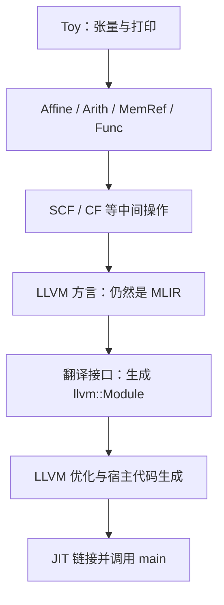
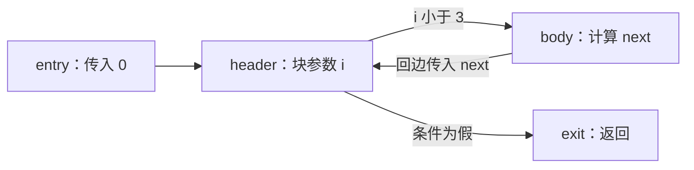

# 第 6 章：降级到 LLVM 并生成代码（扩充教材）

本地原文：[Ch-6.md](/opt/llvm-project/mlir/docs/Tutorials/Toy/Ch-6.md) · [本章源码](/opt/llvm-project/mlir/examples/toy/Ch6/toyc.cpp)

基准：`release/18.x` / `3b5b5c1ec4a3`。本章原文中的若干 API 和 LLVM 文本已滞后于同仓库实现，下列实现摘录直接取自本地代码。

## 1. 降级到 LLVM

上一章把计算部分变为 Affine、Arith、MemRef 和 Func，保留消费 MemRef 的 `toy.print`。本章使用 Dialect Conversion 完成最后转换。打印被展开为 SCF 循环，循环最内层 load 一个 f64 元素，再调用 `printf`；已有转换规则继续把中间操作降至 LLVM 方言。这种 A→B→C 的传递式降级，允许每条规则只处理一个合理的抽象跨度。

### 1.1 外部函数声明与全局字符串

`PrintOpLowering` 继承 `ConversionPattern`。它根据原操作的 `MemRefType` 获取形状，在父 Module 中查找或插入 `printf` 声明。当前 LLVM 指针使用 `!llvm.ptr`，不采用原文历史片段中的 `!llvm<"i8*">`。

> 代码性质：逐字源码（按所引路径与起始行核对；不等于独立可编译）。

[源码：Ch6/mlir/LowerToLLVM.cpp](/opt/llvm-project/mlir/examples/toy/Ch6/mlir/LowerToLLVM.cpp:127)

```c++
  static LLVM::LLVMFunctionType getPrintfType(MLIRContext *context) {
    auto llvmI32Ty = IntegerType::get(context, 32);
    auto llvmPtrTy = LLVM::LLVMPointerType::get(context);
    auto llvmFnType = LLVM::LLVMFunctionType::get(llvmI32Ty, llvmPtrTy,
                                                  /*isVarArg=*/true);
    return llvmFnType;
  }
```

`getOrInsertPrintf` 用 `lookupSymbol<LLVM::LLVMFuncOp>` 避免重复声明；`PatternRewriter::InsertionGuard` 保存插入点，再把新声明插到模块开头。

两个字符串分别为 `StringRef("%f \0", 4)` 和 `StringRef("\n\0", 2)`：长度包含结尾 NUL。`getOrCreateGlobalString` 创建 internal linkage 的常量 `LLVM::GlobalOp`，然后生成 AddressOf 和索引 `[0, 0]` 的 GEP，取得第一个字符的地址。

### 1.2 SCF 循环与换行位置

对形状的每个维度生成 `arith::ConstantIndexOp` 表示 0、维度大小、1，并构造 `scf::ForOp`。为精确控制循环体，源码删除自动产生的 terminator，重新插入 `scf::YieldOp`，再把插入点移回循环体起始处，继续创建更内层循环。

二维张量的外层循环尾部打印换行，内层循环逐元素打印。零秩 MemRef 没有循环，直接用空索引 load 一个元素。源码最内层使用原 `printOp.getInput()` 创建 MemRef load；它是一个先引入 MemRef/SCF、再依靠后续模式合法化的转换，不要把“adaptor 总是应当直接传给新操作”当作不考虑类型阶段的规则。

## 2. Conversion Target、类型转换与规则集合

### 2.1 Conversion Target

本地用 `LLVMConversionTarget` 并显式允许顶层 `ModuleOp`。这比手写只有一行 `addLegalDialect` 更贴近实际实现。转换结束时，所有剩余操作必须被目标判为合法。

### 2.2 Type Converter

`LLVMTypeConverter` 负责将 MemRef 等类型转换为 LLVM 可表示的结构。对于有秩 MemRef，通常需要已分配指针、对齐指针、offset、各维 size 和 stride，而不是只保留一个裸数据指针。类型转换同时影响块参数、函数签名和操作边界。

### 2.3 Conversion Patterns 与完全转换

下面是本地 pass 的完整 `runOnOperation()`。注意 **MemRef 转换规则不可缺少**，而且这里的函数参数和命名空间与旧教程示例有所不同。

> 代码性质：逐字源码（按所引路径与起始行核对；不等于独立可编译）。

[源码：Ch6/mlir/LowerToLLVM.cpp](/opt/llvm-project/mlir/examples/toy/Ch6/mlir/LowerToLLVM.cpp:196)

```c++
void ToyToLLVMLoweringPass::runOnOperation() {
  // The first thing to define is the conversion target. This will define the
  // final target for this lowering. For this lowering, we are only targeting
  // the LLVM dialect.
  LLVMConversionTarget target(getContext());
  target.addLegalOp<ModuleOp>();

  // During this lowering, we will also be lowering the MemRef types, that are
  // currently being operated on, to a representation in LLVM. To perform this
  // conversion we use a TypeConverter as part of the lowering. This converter
  // details how one type maps to another. This is necessary now that we will be
  // doing more complicated lowerings, involving loop region arguments.
  LLVMTypeConverter typeConverter(&getContext());

  // Now that the conversion target has been defined, we need to provide the
  // patterns used for lowering. At this point of the compilation process, we
  // have a combination of `toy`, `affine`, and `std` operations. Luckily, there
  // are already exists a set of patterns to transform `affine` and `std`
  // dialects. These patterns lowering in multiple stages, relying on transitive
  // lowerings. Transitive lowering, or A->B->C lowering, is when multiple
  // patterns must be applied to fully transform an illegal operation into a
  // set of legal ones.
  RewritePatternSet patterns(&getContext());
  populateAffineToStdConversionPatterns(patterns);
  populateSCFToControlFlowConversionPatterns(patterns);
  mlir::arith::populateArithToLLVMConversionPatterns(typeConverter, patterns);
  populateFinalizeMemRefToLLVMConversionPatterns(typeConverter, patterns);
  cf::populateControlFlowToLLVMConversionPatterns(typeConverter, patterns);
  populateFuncToLLVMConversionPatterns(typeConverter, patterns);

  // The only remaining operation to lower from the `toy` dialect, is the
  // PrintOp.
  patterns.add<PrintOpLowering>(&getContext());

  // We want to completely lower to LLVM, so we use a `FullConversion`. This
  // ensures that only legal operations will remain after the conversion.
  auto module = getOperation();
  if (failed(applyFullConversion(module, target, std::move(patterns))))
    signalPassFailure();
}
```

`populateAffineToStdConversionPatterns` 的名字保留了历史用词，不代表本地 IR 中仍存在一个 `std` 方言。SCF 先变为 CF；Arith、MemRef、CF、Func 再分别转换为 LLVM。自定义 Print 模式和标准模式共同构成合法化闭环。

`applyFullConversion` 要求所有操作都合法化；无法转换的未知操作也不能像 partial conversion 那样被默认保留。失败通过 `signalPassFailure()` 传播给 PassManager，驱动不会继续导出这个半成品。

## 3. 代码生成：离开 MLIR

### 3.1 导出 LLVM IR

LLVM 方言仍采用 MLIR 的 `Operation`、`Region`、`Block` 和类型系统。导出为 `llvm::Module` 是下一道明确边界。实现先注册 Builtin 和 LLVM 的翻译接口，再创建独立 `llvm::LLVMContext`，调用 `translateModuleToLLVMIR(module, llvmContext)`。

本地还用 `JITTargetMachineBuilder::detectHost()` 和 `createTargetMachine()` 得到宿主 TargetMachine，再调用 `ExecutionEngine::setupTargetTripleAndDataLayout`。不能照抄上版教材中的 `setupTargetTriple`。

> 代码性质：逐字源码（按所引路径与起始行核对；不等于独立可编译）。

[源码：Ch6/toyc.cpp](/opt/llvm-project/mlir/examples/toy/Ch6/toyc.cpp:212)

```c++
int dumpLLVMIR(mlir::ModuleOp module) {
  // Register the translation to LLVM IR with the MLIR context.
  mlir::registerBuiltinDialectTranslation(*module->getContext());
  mlir::registerLLVMDialectTranslation(*module->getContext());

  // Convert the module to LLVM IR in a new LLVM IR context.
  llvm::LLVMContext llvmContext;
  auto llvmModule = mlir::translateModuleToLLVMIR(module, llvmContext);
  if (!llvmModule) {
    llvm::errs() << "Failed to emit LLVM IR\n";
    return -1;
  }

  // Initialize LLVM targets.
  llvm::InitializeNativeTarget();
  llvm::InitializeNativeTargetAsmPrinter();

  // Configure the LLVM Module
  auto tmBuilderOrError = llvm::orc::JITTargetMachineBuilder::detectHost();
  if (!tmBuilderOrError) {
    llvm::errs() << "Could not create JITTargetMachineBuilder\n";
    return -1;
  }

  auto tmOrError = tmBuilderOrError->createTargetMachine();
  if (!tmOrError) {
    llvm::errs() << "Could not create TargetMachine\n";
    return -1;
  }
  mlir::ExecutionEngine::setupTargetTripleAndDataLayout(llvmModule.get(),
                                                        tmOrError.get().get());

  /// Optionally run an optimization pipeline over the llvm module.
  auto optPipeline = mlir::makeOptimizingTransformer(
      /*optLevel=*/enableOpt ? 3 : 0, /*sizeLevel=*/0,
      /*targetMachine=*/nullptr);
  if (auto err = optPipeline(llvmModule.get())) {
    llvm::errs() << "Failed to optimize LLVM IR " << err << "\n";
    return -1;
  }
  llvm::errs() << *llvmModule << "\n";
  return 0;
}
```

`enableOpt` 决定 LLVM 优化等级是 3 还是 0。优化器可能把常量张量的循环与中间分配进一步消去，留下几次带常量参数的打印调用。这个结果依赖输入、目标和 pass，不应把某次生成的 `%123` 名字或基本块编号当成固定接口。

### 3.2 设置 JIT

本地通过 `ExecutionEngineOptions::transformer` 传入优化函数，调用 `ExecutionEngine::create(module, engineOptions)`，最后 `invokePacked("main")`。这些都是源码中的实际调用形式：

> 代码性质：逐字源码（按所引路径与起始行核对；不等于独立可编译）。

[源码：Ch6/toyc.cpp](/opt/llvm-project/mlir/examples/toy/Ch6/toyc.cpp:256)

```c++
int runJit(mlir::ModuleOp module) {
  // Initialize LLVM targets.
  llvm::InitializeNativeTarget();
  llvm::InitializeNativeTargetAsmPrinter();

  // Register the translation from MLIR to LLVM IR, which must happen before we
  // can JIT-compile.
  mlir::registerBuiltinDialectTranslation(*module->getContext());
  mlir::registerLLVMDialectTranslation(*module->getContext());

  // An optimization pipeline to use within the execution engine.
  auto optPipeline = mlir::makeOptimizingTransformer(
      /*optLevel=*/enableOpt ? 3 : 0, /*sizeLevel=*/0,
      /*targetMachine=*/nullptr);

  // Create an MLIR execution engine. The execution engine eagerly JIT-compiles
  // the module.
  mlir::ExecutionEngineOptions engineOptions;
  engineOptions.transformer = optPipeline;
  auto maybeEngine = mlir::ExecutionEngine::create(module, engineOptions);
  assert(maybeEngine && "failed to construct an execution engine");
  auto &engine = maybeEngine.get();

  // Invoke the JIT-compiled function.
  auto invocationResult = engine->invokePacked("main");
  if (invocationResult) {
    llvm::errs() << "JIT invocation failed\n";
    return -1;
  }

  return 0;
}
```

`invokePacked` 对应 ExecutionEngine 的打包调用入口；本例 `main` 无参数、无返回值，所以没有额外参数数组。源码对引擎创建成功使用 assert；这展示了教程的简化错误处理，面向用户的工具通常还需要消费并报告 `llvm::Error`。

## 4. 驱动程序实际如何决定流水线

`loadAndProcessMLIR` 比较 `emitAction` 的枚举值来决定是否进入 Affine 和 LLVM 阶段。即使没有 `-opt`，只要请求 `mlir-affine` 或更低层输出，内联和形状推断就必须运行，否则没有足够信息生成静态循环。

| 阶段 | Module 上的 pass | 嵌套 pass |
|---|---|---|
| Toy 前处理 | Inliner | `toy.func`：ShapeInference → Canonicalizer → CSE |
| Affine 降级 | LowerToAffine | `func.func`：Canonicalizer → CSE |
| `-opt` 附加优化 | — | `func.func`：LoopFusion → AffineScalarReplacement |
| LLVM 降级 | LowerToLLVM → DIScopeForLLVMFuncOp | — |

最后的 debug scope pass 为基本调试行表提供作用域信息，不是完整的源语言变量调试信息实现。

## 5. 运行与观察

先按 [环境准备](../aiversion/00-preflight.md) 构建并设置 `TOY_BUILD`。本地现有 `/opt/llvm-project/build` 未启用 MLIR，不能直接假定其中已有这些二进制。

```bash
${TOY_BUILD}/bin/toyc-ch6 /opt/llvm-project/mlir/test/Examples/Toy/Ch6/jit.toy -emit=jit
${TOY_BUILD}/bin/toyc-ch6 /opt/llvm-project/mlir/test/Examples/Toy/Ch6/codegen.toy -emit=mlir
${TOY_BUILD}/bin/toyc-ch6 /opt/llvm-project/mlir/test/Examples/Toy/Ch6/codegen.toy -emit=mlir-affine
${TOY_BUILD}/bin/toyc-ch6 /opt/llvm-project/mlir/test/Examples/Toy/Ch6/codegen.toy -emit=mlir-llvm
${TOY_BUILD}/bin/toyc-ch6 /opt/llvm-project/mlir/test/Examples/Toy/Ch6/codegen.toy -emit=llvm
```

第一个命令的数学结果为两行 `1 2`、`3 4`；源码格式字符串使每个数显示为六位小数，元素后有空格。AST、MLIR 和 LLVM IR 的 dump 写到 **stderr**，应使用 `2> output.mlir` 或 `2> output.ll` 捕获；JIT 的 `printf` 输出写到 stdout。

### 5.1 原文使用的 llvm-lowering.mlir 输入

本地英文原文还引用了 [llvm-lowering.mlir](/opt/llvm-project/mlir/test/Examples/Toy/Ch6/llvm-lowering.mlir)。它从 **Toy 方言 IR** 开始，不是预先降好的混合 IR；可以对同一输入选择不同停止阶段：

```bash
"${TOY_BUILD}/bin/toyc-ch6" /opt/llvm-project/mlir/test/Examples/Toy/Ch6/llvm-lowering.mlir -emit=mlir-affine
"${TOY_BUILD}/bin/toyc-ch6" /opt/llvm-project/mlir/test/Examples/Toy/Ch6/llvm-lowering.mlir -emit=mlir-llvm
"${TOY_BUILD}/bin/toyc-ch6" /opt/llvm-project/mlir/test/Examples/Toy/Ch6/llvm-lowering.mlir -emit=llvm -opt
```

注意本地该文件的 RUN 只有 `toyc-ch6 %s -emit=llvm -opt`，**没有管道连接 FileCheck**。它虽保留若干 CHECK 注释，最后一个浮点数却写成 `3.000000e+01`（30）；输入最后一个元素为 6，逐元素自乘应为 36，即 `3.600000e+01`。因此不能把这些未接入 RUN 的历史 CHECK 当作已验证的数值金标准，也不要直接添加 FileCheck 管道并期待成功。上述命令用于观察各层 IR；本文未执行这些命令，未修改上游测试。

需要追踪 pass 时加入 `-mlir-disable-threading -mlir-print-ir-after-all`。示例输出来自本地测试约定与源码推导；本文没有把未构建运行的结果声称为实测。

下一章在高层加入结构体，并通过折叠把它重新接入这套后端。

## 6. 一条完整的后端链：哪些地方仍然属于 MLIR

“降到 LLVM”常被用来描述好几件不同的事。本章必须把它们分开，否则遇到错误时就不知道该检查哪层。



图中的中间方言不是要求每个阶段都单独运行一个 pass、打印一个文件。本地 LowerToLLVM 把多组 pattern 放进一次 full conversion，让规则之间传递地产生并消除中间操作。

LLVM 方言的 `llvm.func` 仍是 MLIR Operation，使用 MLIR 类型和 Region；LLVM IR 中的 `define` 对应的是 LLVM 自己的 Function、BasicBlock 和 Instruction。前者通过 MLIR 的 verifier 并不自动意味着已获得一个可执行程序：还要有翻译接口、目标信息、符号解析以及机器码生成。

这个区分也解释了两个看似重复的命令。`-emit=mlir-llvm` 停在 LLVM 方言，适合调试 lowering；`-emit=llvm` 输出 LLVM IR，适合观察 LLVM 优化及后端输入。若前者成功后者失败，应优先检查翻译和目标配置，而不是从词法分析重新查起。

## 7. MemRef 为什么不能简单替换成一个指针

以本章常见的连续行主序 `memref<2x3xf64>` 为例，读取元素 `[i,j]` 需要知道第二维的跨度。一个一般的有秩 MemRef 描述符包含以下概念字段：

| 字段 | 用途 | 本例的典型值 |
|---|---|---|
| allocated pointer | 记录原始分配地址，释放时使用 | 原始分配返回的指针 |
| aligned pointer | 元素寻址采用的对齐地址 | 可能与原始地址相同 |
| offset | 逻辑原点相对 aligned pointer 的元素偏移 | 0 |
| sizes | 每一维的元素个数 | [2, 3] |
| strides | 每一维索引增加 1 时跨越的元素数 | [3, 1] |

这里描述的是默认 lowering 中的概念结构，不是要求你手写或依赖某一目标的字节布局。静态已知的字段还可能被 LLVM 优化传播为常量；函数参数传递时，描述符也可能按转换约定展开，不能把表格等同于“永远传一个结构体指针”。

地址的核心公式是：

```text
元素偏移 = offset + i * stride[0] + j * stride[1]
元素地址 = aligned_pointer + 元素偏移 * sizeof(f64)
```

在 offset=0、strides=[3,1] 时，`[1,2]` 的元素偏移是 5，对应 40 字节。公式中的 stride 和 offset 以**元素**为单位；生成 GEP 时由元素类型参与计算，不是先手工乘 8 后又把这个字节数作为 f64 索引乘第二次。

allocated pointer 与 aligned pointer 分开，是因为对齐后的可访问地址不一定等于分配器要求释放的原始地址。对这个细节一无所知地把 memref.dealloc 翻成 free(aligned_pointer)，在存在对齐调整时就可能错误。通用 MemRef lowering 把这类责任封装起来，Toy 无需重新实现它。

### 7.1 index 不是语言里的另一个 double

循环归纳变量与内存索引使用 `index`，张量元素使用 `f64`。它们各自服务于地址计算与数值计算。MLIR 的 index 是抽象的整数索引类型；转换到 LLVM 时，其宽度由转换配置及目标数据布局等约定决定。教材不能把它定义成“永远等于 i64”，即使常见 64 位宿主的输出确实如此。

同样，`!llvm.ptr` 是不带 pointee type 的指针类型，并不意味着 load 或 GEP 不再需要类型信息。访问的元素类型仍由操作上的信息表达。旧教程出现的 typed pointer 文本与本地 opaque pointer API 是版本差异，不能混合粘贴。

## 8. 循环变成基本块后，迭代变量去了哪里

结构化循环把初始化、条件和步进收在一个操作及其 Region 里。CF 层则显式写出控制流边。下面是一个只用于解释 CFG 的完整 MLIR 函数；循环体没有业务计算：

> 代码性质：示意（非逐字源码，未编译或运行验证）。

```mlir
module {
  func.func @loop() {
    %c0 = arith.constant 0 : index
    %c1 = arith.constant 1 : index
    %c3 = arith.constant 3 : index
    cf.br ^header(%c0 : index)
  ^header(%i : index):
    %cond = arith.cmpi slt, %i, %c3 : index
    cf.cond_br %cond, ^body, ^exit
  ^body:
    %next = arith.addi %i, %c1 : index
    cf.br ^header(%next : index)
  ^exit:
    return
  }
}
```

`%i` 不是一个被不断赋值的局部变量，而是 header 的块参数。第一次进入时收到 0，走回边时收到 %next。每条动态执行路径都为这次进入提供一个值，这正是循环与 SSA 能同时成立的原因。在最终 LLVM IR 中，相应的合流通常由 phi 指令表示。



SCF→CF 负责展开这类控制流；CF→LLVM 负责把分支、块参数及其类型接入 LLVM 表示。仅仅把 `scf.for` 的操作名换成某个 LLVM 操作名，无法完成这些语义工作。

## 9. 打印不是数学操作：外部世界从哪里接进来

前面可以删除死常量和多余计算，因为它们没有可观察的副作用。打印不同：它改变程序外部可观察的输出。PrintOpLowering 必须保留元素的访问和输出顺序，不能因为没有 SSA 结果就把它当作无用操作。

本地方案不依赖一个专门的 Toy 张量运行时库，而是逐元素调用 C 的 printf。声明的固定参数只有格式字符串指针，其余参数通过可变参数传递，返回值是 i32。对于 `%f`，C 可变参数约定期望的是 double；Toy 的元素恰好已经是 f64。如果以后增加 f32 元素，就不能机械复用当前路径而忽略默认参数提升与 ABI 约定。

字符串是模块级常量，不是在每次循环迭代里动态拼接。格式字符串 `"%f "` 有三个可见字符，加结尾 NUL 共四个字节；换行字符串有换行和 NUL 两个字节。遗漏 NUL 会使 C 字符串读取越过预期边界，不只是“少显示一个字符”。

插入点守卫也很重要：正在创建循环体时，为插入全局字符串临时跳到 Module 的开头，结束后必须返回原位置。否则随后的 load 或 call 可能被错误地建在模块层，而不是函数/循环体中。

### 9.1 精确理解换行

源码仅在“当前维度不是最后一维”的循环尾部加换行。因此：

- 二维数据：每完成一行打印一次换行。
- 一维数据：只打印各元素和元素后的空格，没有额外的最终换行。
- 零秩数据：没有循环，用空下标读取标量，再打印一个元素；同样不额外换行。
- 更高秩数据：非最内层维度都会产生分隔换行，但不要把这等同于设计完善的高维 pretty printer。

这一行为可以直接从 `if (i != e - 1)` 推导，而不必猜测“print 一定自带换行”。Shell 提示符紧接在一维输出后面，并不一定是 JIT 出错。

### 9.2 外部符号为什么可能在最后才失败

IR 中声明 `printf` 只说明它的名字和函数类型，并没有实现它。JIT 需要在目标进程可用的符号中解析相关函数；分配和释放也依赖后端选用的运行时函数。若 lowering 成功但 JIT 报符号缺失，应检查链接/加载环境与符号解析，而不是仅检查 Toy 语法。教程面向本机执行，不能据此声称支持任意目标的远程执行。

## 10. 两套优化不要混为一谈

本地驱动的 `-opt` 同时影响不止一个层次。Toy 层可以做规范化与去重；Affine 层可做融合和标量替换；LLVM IR 层的 transformer 使用优化级别 3。它们处理的表示、可见信息和成本模型都不同。

例如双重转置最好在 Toy 层直接消掉，因为那里操作语义明确。等到转成两套循环和中间 buffer，后端不再直接看到“转置的转置”，只能尝试从地址与依赖关系恢复等价性。相反，寄存器、目标指令和机器级优化是更低层的事情，高层 Toy pass 不应该提前猜测。

| 请求 | 主要停止位置 | 即使不加 -opt 仍必须做的准备 |
|---|---|---|
| -emit=mlir | Toy MLIR | AST 到 IR 和验证；是否额外前处理取决于 -opt |
| -emit=mlir-affine | 混合 Affine 等方言 | 内联、形状推断及必要的规范化 |
| -emit=mlir-llvm | LLVM 方言 | 前述处理及完整 LLVM lowering |
| -emit=llvm | LLVM IR 文本 | 翻译、宿主目标配置、所选 LLVM 优化管线 |
| -emit=jit | 执行 main | 翻译、JIT 编译/链接与调用 |

因此“不加 -opt”不意味着“完全不运行 pass”。前面那些让 lowering 的输入满足前提的转换，是正确性所必需的准备，不是可随意删除的性能优化。

## 11. 实验：从正确的输出通道捕获证据

确认第 0 章的二进制已经构建后，可以用同一个测试沿链条观察。下面命令在当前工作目录生成实验输出文件，不修改 LLVM 源码：

```bash
"${TOY_BUILD}/bin/toyc-ch6" /opt/llvm-project/mlir/test/Examples/Toy/Ch6/jit.toy -emit=mlir-affine 2> stage-affine.mlir
"${TOY_BUILD}/bin/toyc-ch6" /opt/llvm-project/mlir/test/Examples/Toy/Ch6/jit.toy -emit=mlir-llvm 2> stage-llvm.mlir
"${TOY_BUILD}/bin/toyc-ch6" /opt/llvm-project/mlir/test/Examples/Toy/Ch6/jit.toy -emit=llvm 2> stage.ll
"${TOY_BUILD}/bin/toyc-ch6" /opt/llvm-project/mlir/test/Examples/Toy/Ch6/jit.toy -emit=jit > result.txt 2> jit-errors.txt
```

dump 写 stderr，程序的 printf 写 stdout，这是本地驱动的选择，不是所有编译器的统一惯例。若前一命令失败，stderr 文件会包含诊断而不是合法 IR；先检查退出状态，再交给下一工具。不要同时打开 `-mlir-print-ir-after-all` 并把所有 stderr 当成一份可重新解析的单模块文件。

实验中的二维输出按测试和格式字符串应为：

```text
1.000000 2.000000 
3.000000 4.000000 
```

这是源码和测试规定的预期，不是本文声称已经运行得到的日志。

| 失败发生在哪一步 | 优先检查 |
|---|---|
| Toy→Affine | 是否残留 generic_call、cast、reshape，是否有完整静态 shape |
| 混合 IR→LLVM 方言 | 非法操作名称、缺少哪组 conversion patterns、边界类型是否一致 |
| LLVM 方言→LLVM IR | 是否注册翻译接口，是否仍有无法导出的操作 |
| 创建 JIT 引擎 | 宿主目标初始化、目标后端是否构建、引擎返回的 Error |
| 调用 main | main 的名字及签名、外部符号是否可解析 |
| 运行结果错误 | 索引映射、store 初始化、释放时机、ABI 和格式字符串 |

## 12. 带解析的练习

**问题一：** `memref<2x3xf64>` 的 `[1,1]` 在默认连续布局中距逻辑起点多少字节？

答：元素偏移为 1×3+1=4，f64 为 8 字节，共 32 字节。若 offset 或 stride 不同，必须重新代入描述符，不能只看 shape。

**问题二：** 为什么第 6 章需要 MemRef→LLVM pattern，前一章不是已经转换过 tensor 了吗？

答：前一章得到的仍是 MLIR MemRef 分配、读写和释放。它们需要进一步转换成 LLVM 可表示的指针、描述符、地址计算与运行时调用。Tensor→MemRef 和 MemRef→LLVM 是两道不同边界。

**问题三：** 只得到一份 `llvm.func` 文本，是否已经生成机器码？

答：没有。它仍然是 LLVM 方言的 MLIR，需要翻译到 LLVM IR，再经过后端。JIT 还要链接并调用入口。

**问题四：** JIT 是不是解释器？为什么这里调用 invokePacked？

答：这里的执行引擎通过 LLVM JIT 生成并调用本机代码，不是逐条解释 Toy AST。打包调用入口为宿主调用生成函数提供统一约定；本地 main 无参数、无返回值，使这个接口的使用最简单。若扩展带张量参数的入口，还需要正确构造与传递描述符，不能只传一个 C++ 数组地址。

<a id="code-lab"></a>

## 13. 关键代码与实验：给打印建立外部调用边界

本章已展示完整 LLVM 转换规则集合、导出函数与 JIT 设置。这里不再复制这些长函数，只补足“从一个 toy.print 到模块符号、标量 load 和 call”的连接。

### 13.1 为什么在循环外查找/插入 printf 声明

> 代码性质：逐字源码（按所引路径与起始行核对；不等于独立可编译）。

[源码：Ch6/mlir/LowerToLLVM.cpp](/opt/llvm-project/mlir/examples/toy/Ch6/mlir/LowerToLLVM.cpp:137)

```c++
  static FlatSymbolRefAttr getOrInsertPrintf(PatternRewriter &rewriter,
                                             ModuleOp module) {
    auto *context = module.getContext();
    if (module.lookupSymbol<LLVM::LLVMFuncOp>("printf"))
      return SymbolRefAttr::get(context, "printf");

    // Insert the printf function into the body of the parent module.
    PatternRewriter::InsertionGuard insertGuard(rewriter);
    rewriter.setInsertionPointToStart(module.getBody());
    rewriter.create<LLVM::LLVMFuncOp>(module.getLoc(), "printf",
                                      getPrintfType(context));
    return SymbolRefAttr::get(context, "printf");
  }
```

已有 printf 符号时直接返回引用；没有时保存当前插入点，到 Module 开头创建 LLVMFuncOp 声明，再由守卫恢复原位置。它没有在这里实现 printf 的函数体，也没有发起运行时调用。

所以一次声明被多个打印复用，是模块符号管理；每个元素打印一次，是循环体中的 call。把这两个频率混淆，会误以为每次迭代都在创建函数或全局字符串。

### 13.2 最内层怎样把一个元素交给 printf

此时格式字符串指针已经创建，loopIvs 已包含各层循环变量：

> 代码性质：逐字源码（按所引路径与起始行核对；不等于独立可编译）。

[源码：Ch6/mlir/LowerToLLVM.cpp](/opt/llvm-project/mlir/examples/toy/Ch6/mlir/LowerToLLVM.cpp:111)

```c++
    // Generate a call to printf for the current element of the loop.
    auto printOp = cast<toy::PrintOp>(op);
    auto elementLoad =
        rewriter.create<memref::LoadOp>(loc, printOp.getInput(), loopIvs);
    rewriter.create<LLVM::CallOp>(
        loc, getPrintfType(context), printfRef,
        ArrayRef<Value>({formatSpecifierCst, elementLoad}));

    // Notify the rewriter that this operation has been removed.
    rewriter.eraseOp(op);
    return success();
```

MemRef Load 的结果是 f64，而不是一个完整张量；LLVM::CallOp 接收格式字符串指针和这个元素。生成这些操作后，原 toy.print 被删除，避免同一次打印既留下高层操作又出现低层调用。

这里短暂混合了 MemRef、SCF 和 LLVM 方言操作。只有随后标准转换规则也完成合法化，full conversion 才能成功；不要截取这个中间状态就声称“所有 IR 已经是 LLVM 方言”。

### 13.3 用一个输入沿每个停止点保存 IR

```bash
cmake --build "$TOY_BUILD" --target toyc-ch6 --parallel 2
for stage in mlir mlir-affine mlir-llvm llvm; do
  if ! "$TOY_BUILD/bin/toyc-ch6" \
    /opt/llvm-project/mlir/test/Examples/Toy/Ch6/jit.toy \
    "-emit=$stage" 2> "$TOY_LAB/ch6-$stage.txt"; then
    printf '失败阶段：%s\n' "$stage"
    break
  fi
done
```

按层检查文件：

| 文件 | 应重点找什么 | 说明 |
|---|---|---|
| ch6-mlir.txt | toy.constant、toy.print | 输入仍是 Toy 张量程序 |
| ch6-mlir-affine.txt | alloc、store、消费 MemRef 的 toy.print | 计算已具备内存语义，打印尚保留 |
| ch6-mlir-llvm.txt | llvm.func、llvm.call、全局字符串 | 全转换结束，仍是 MLIR |
| ch6-llvm.txt | define、call、声明和全局常量 | 已翻译到 LLVM 自身的 IR |

jit.toy 直接打印一个常量，没有转置/乘法；因此 Affine 阶段看不到计算循环并不奇怪。打印循环在下一阶段才由 PrintOpLowering 生成。研究张量计算循环则使用第 5 章的输入，别用错误的观察对象寻找根本不存在的操作。

上述流程没有 -opt；再单独对比 LLVM 层优化：

```bash
"$TOY_BUILD/bin/toyc-ch6" \
  /opt/llvm-project/mlir/test/Examples/Toy/Ch6/jit.toy \
  -emit=llvm -opt 2> "$TOY_LAB/ch6-llvm-opt.txt"
diff -u "$TOY_LAB/ch6-llvm.txt" "$TOY_LAB/ch6-llvm-opt.txt"
```

常量和循环有可能被进一步简化，但操作名消失并不证明运行结果正确。下一步仍要单独执行并检查 stdout。

### 13.4 JIT 的数值输出与编译诊断分开保存

```bash
if "$TOY_BUILD/bin/toyc-ch6" \
  /opt/llvm-project/mlir/test/Examples/Toy/Ch6/jit.toy \
  -emit=jit > "$TOY_LAB/ch6-result.txt" 2> "$TOY_LAB/ch6-jit-errors.txt"; then
  sed -n '1,5p' "$TOY_LAB/ch6-result.txt"
else
  sed -n '1,90p' "$TOY_LAB/ch6-jit-errors.txt"
fi
```

源码规定的预期为两行 1、2 和 3、4，每个数打印六位小数，后有空格。如果 LLVM IR 已成功生成但 JIT 失败，优先检查执行引擎、宿主目标、外部符号和入口，而不是仅凭最终失败就怀疑 Parser。

本轮没有运行 JIT；以上是帮助你建立证据链的命令。尤其不要用 llvm-lowering.mlir 里过期的最后一条 CHECK 去否定正确的数值推导，相关边界已在 §5.1 说明。
