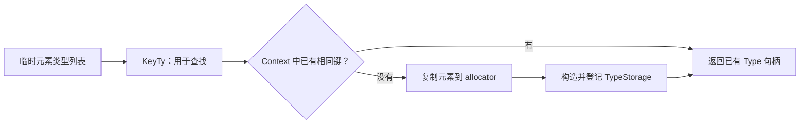
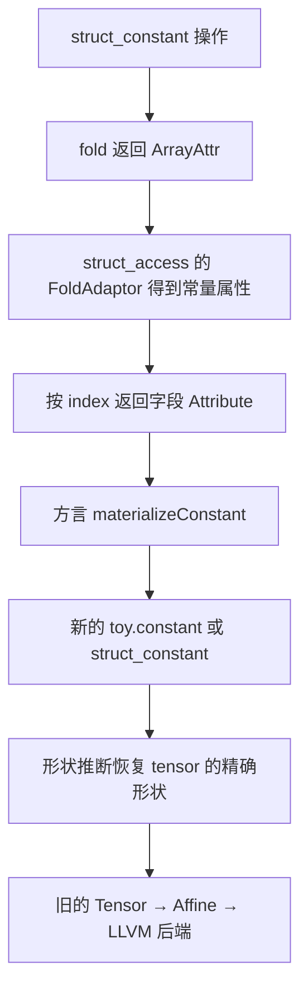

# 第 7 章：为 Toy 添加复合类型（扩充教材）

本地原文：[Ch-7.md](/opt/llvm-project/mlir/docs/Tutorials/Toy/Ch-7.md) · [本章源码](/opt/llvm-project/mlir/examples/toy/Ch7/toyc.cpp)

基准：`release/18.x` / `3b5b5c1ec4a3`。正文按官方主线译编；原文与实现不一致处，以本地代码校正并说明。C++、TableGen 与 MLIR 代码块分别标为“逐字源码”“译编”或“示意”；只有带源码锚点的逐字摘录参与逐行核对，完整实现见源码链接。

本章为 Toy 增加 `struct`，展示自定义参数化类型的存储、唯一化、ODS 暴露、文本解析/打印、操作支持与常量折叠。

## 1. Toy 源语言中的 struct

```toy
struct Pair {
  var a;
  var b;
}

def multiply_transpose(Pair value) {
  return transpose(value.a) * transpose(value.b);
}

def main() {
  Pair value = {
    [[1, 2, 3], [4, 5, 6]],
    [[1, 2, 3], [4, 5, 6]]
  };
  print(multiply_transpose(value));
}
```

结构体声明包含无初始化器、无形状的字段；字段也可以是先前声明的结构体。用 `{...}` 构造复合值，用 `.` 访问成员。

## 2. MLIR 中的 `StructType`

Toy 的 MLIR 表示不保留源语言结构体名和字段名，只保留按顺序排列的元素类型：

> 代码性质：示意（非逐字源码，未编译或运行验证）。

```mlir
!toy.struct<tensor<*xf64>, tensor<*xf64>>
```

### 2.1 类型存储与唯一化

MLIR `Type` 是轻量值对象，实际参数数据保存在 `TypeStorage` 中，并在同一 `MLIRContext` 内唯一化。参数化类型需定义存储类：

> 代码性质：逐字源码（按所引路径与起始行核对；不等于独立可编译）。

[源码：Ch7/mlir/Dialect.cpp](/opt/llvm-project/mlir/examples/toy/Ch7/mlir/Dialect.cpp:509)

```c++
struct StructTypeStorage : public mlir::TypeStorage {
  /// The `KeyTy` is a required type that provides an interface for the storage
  /// instance. This type will be used when uniquing an instance of the type
  /// storage. For our struct type, we will unique each instance structurally on
  /// the elements that it contains.
  using KeyTy = llvm::ArrayRef<mlir::Type>;

  /// A constructor for the type storage instance.
  StructTypeStorage(llvm::ArrayRef<mlir::Type> elementTypes)
      : elementTypes(elementTypes) {}

  /// Define the comparison function for the key type with the current storage
  /// instance. This is used when constructing a new instance to ensure that we
  /// haven't already uniqued an instance of the given key.
  bool operator==(const KeyTy &key) const { return key == elementTypes; }

  /// Define a hash function for the key type. This is used when uniquing
  /// instances of the storage, see the `StructType::get` method.
  /// Note: This method isn't necessary as both llvm::ArrayRef and mlir::Type
  /// have hash functions available, so we could just omit this entirely.
  static llvm::hash_code hashKey(const KeyTy &key) {
    return llvm::hash_value(key);
  }

  /// Define a construction function for the key type from a set of parameters.
  /// These parameters will be provided when constructing the storage instance
  /// itself.
  /// Note: This method isn't necessary because KeyTy can be directly
  /// constructed with the given parameters.
  static KeyTy getKey(llvm::ArrayRef<mlir::Type> elementTypes) {
    return KeyTy(elementTypes);
  }

  /// Define a construction method for creating a new instance of this storage.
  /// This method takes an instance of a storage allocator, and an instance of a
  /// `KeyTy`. The given allocator must be used for *all* necessary dynamic
  /// allocations used to create the type storage and its internal.
  static StructTypeStorage *construct(mlir::TypeStorageAllocator &allocator,
                                      const KeyTy &key) {
    // Copy the elements from the provided `KeyTy` into the allocator.
    llvm::ArrayRef<mlir::Type> elementTypes = allocator.copyInto(key);

    // Allocate the storage instance and construct it.
    return new (allocator.allocate<StructTypeStorage>())
        StructTypeStorage(elementTypes);
  }

  /// The following field contains the element types of the struct.
  llvm::ArrayRef<mlir::Type> elementTypes;
};
```

`KeyTy` 决定相等性和唯一化键；所有动态数据必须复制到 MLIR 提供的 allocator，不能引用临时容器。

### 2.2 类型类

下方是简化示意，省略了源码的命名空间分层；真实类的存储类型为 `detail::StructTypeStorage`，还声明 `static constexpr StringLiteral name = "toy.struct"`，且 `get()`、`getElementTypes()` 在 `.cpp` 中定义，详见 [Dialect.h](/opt/llvm-project/mlir/examples/toy/Ch7/include/toy/Dialect.h)。

> 代码性质：示意（非逐字源码，未编译或运行验证）。

```c++
class StructType : public Type::TypeBase<
    StructType, Type, StructTypeStorage> {
public:
  using Base::Base;

  static StructType get(ArrayRef<Type> elementTypes) {
    assert(!elementTypes.empty());
    return Base::get(elementTypes.front().getContext(), elementTypes);
  }

  ArrayRef<Type> getElementTypes() const {
    return getImpl()->elementTypes;
  }
};
```

在 `ToyDialect::initialize()` 中调用 `addTypes<StructType>()` 注册。注册时存储类定义必须可见。

## 3. 暴露给 ODS

> 代码性质：示意（非逐字源码，未编译或运行验证）。

```tablegen
def Toy_StructType : DialectType<
    Toy_Dialect,
    CPred<"::llvm::isa<StructType>($_self)">,
    "Toy struct type">;

def Toy_Type : AnyTypeOf<[F64Tensor, Toy_StructType]>;
```

这样操作定义就能像引用 Tensor 约束一样引用 StructType。

## 4. 自定义解析与打印

方言类型的一般形式为 `!方言<类型数据>`。Toy 选择：

```text
struct-type ::= `struct` `<` type (`,` type)* `>`
```

`ToyDialect::parseType` 依次解析 `struct<`、一个或多个元素类型、逗号与 `>`，并验证元素只能是 Tensor 或嵌套 Struct。`printType` 输出相同语法。二者必须 round-trip：

```text
文本 → parseType → StructType → printType → 等价文本
```

### 4.1 本地解析与打印的实际实现

下面保留完整函数，便于观察失败返回、递归类型解析和错误位置；不是将递归语法说明误认为已展示了实现。

> 代码性质：逐字源码（按所引路径与起始行核对；不等于独立可编译）。

[源码：Ch7/mlir/Dialect.cpp](/opt/llvm-project/mlir/examples/toy/Ch7/mlir/Dialect.cpp:582)

```c++
mlir::Type ToyDialect::parseType(mlir::DialectAsmParser &parser) const {
  // Parse a struct type in the following form:
  //   struct-type ::= `struct` `<` type (`,` type)* `>`

  // NOTE: All MLIR parser function return a ParseResult. This is a
  // specialization of LogicalResult that auto-converts to a `true` boolean
  // value on failure to allow for chaining, but may be used with explicit
  // `mlir::failed/mlir::succeeded` as desired.

  // Parse: `struct` `<`
  if (parser.parseKeyword("struct") || parser.parseLess())
    return Type();

  // Parse the element types of the struct.
  SmallVector<mlir::Type, 1> elementTypes;
  do {
    // Parse the current element type.
    SMLoc typeLoc = parser.getCurrentLocation();
    mlir::Type elementType;
    if (parser.parseType(elementType))
      return nullptr;

    // Check that the type is either a TensorType or another StructType.
    if (!llvm::isa<mlir::TensorType, StructType>(elementType)) {
      parser.emitError(typeLoc, "element type for a struct must either "
                                "be a TensorType or a StructType, got: ")
          << elementType;
      return Type();
    }
    elementTypes.push_back(elementType);

    // Parse the optional: `,`
  } while (succeeded(parser.parseOptionalComma()));

  // Parse: `>`
  if (parser.parseGreater())
    return Type();
  return StructType::get(elementTypes);
}
```

`parseType(elementType)` 委托通用解析器处理字段类型；`parseOptionalComma()` 的成功表示继续下一字段。失败分支返回空 Type，避免用未完成的元素列表构造 StructType。注意检查允许 TensorType 或 StructType，并不在此单独要求所有 Tensor 元素为 f64。

> 代码性质：逐字源码（按所引路径与起始行核对；不等于独立可编译）。

[源码：Ch7/mlir/Dialect.cpp](/opt/llvm-project/mlir/examples/toy/Ch7/mlir/Dialect.cpp:623)

```c++
void ToyDialect::printType(mlir::Type type,
                           mlir::DialectAsmPrinter &printer) const {
  // Currently the only toy type is a struct type.
  StructType structType = llvm::cast<StructType>(type);

  // Print the struct type according to the parser format.
  printer << "struct<";
  llvm::interleaveComma(structType.getElementTypes(), printer);
  printer << '>';
}
```

打印器递归打印每个元素类型，并在相邻元素之间插入逗号；它不保存源文件空白。与前面的类型唯一化结合，目标是解析—打印—再解析得到相同语义的类型，不是文本逐字不变。

## 5. 让操作支持 StructType

### 5.1 更新现有操作

例如 `toy.return` 的输入从仅接收张量改为接收 `Toy_Type`：

> 代码性质：示意（非逐字源码，未编译或运行验证）。

```tablegen
let arguments = (ins Variadic<Toy_Type>:$input);
```

### 5.2 新操作

`toy.struct_constant` 用 `ArrayAttr` 保存各字段的常量属性：

> 代码性质：示意（非逐字源码，未编译或运行验证）。

```mlir
%s = toy.struct_constant [
  dense<[[1.0, 2.0], [3.0, 4.0]]> : tensor<2x2xf64>,
  dense<[[5.0, 6.0], [7.0, 8.0]]> : tensor<2x2xf64>
] : !toy.struct<tensor<*xf64>, tensor<*xf64>>
```

`toy.struct_access` 按索引取得第 N 个元素：

> 代码性质：示意（非逐字源码，未编译或运行验证）。

```mlir
%a = toy.struct_access %s[0]
  : !toy.struct<tensor<*xf64>, tensor<*xf64>> -> tensor<*xf64>
```

## 6. 常量折叠

内联后常见模式是从 `struct_constant` 立即取字段。为相关操作启用 `hasFolder` 并实现 `fold`：

> 代码性质：示意（非逐字源码，未编译或运行验证）。

```c++
OpFoldResult StructConstantOp::fold(FoldAdaptor adaptor) {
  return getValue();
}

OpFoldResult StructAccessOp::fold(FoldAdaptor adaptor) {
  auto values = llvm::dyn_cast_if_present<ArrayAttr>(adaptor.getInput());
  if (!values)
    return nullptr;
  return values[getIndex()];
}
```

方言还实现 `materializeConstant`：Tensor 常量物化为 `toy.constant`，Struct 常量物化为 `toy.struct_constant`。这使通用折叠框架能把属性重新变为正确的 Toy 操作。

常量结构体被完全折叠后，后续流水线只看到普通张量常量、转置、乘法和打印，因此第 5、6 章的 lowering 不必因 struct 而修改。

## 7. 运行

```bash
${TOY_BUILD}/bin/toyc-ch7 \
  /opt/llvm-project/mlir/test/Examples/Toy/Ch7/struct-codegen.toy \
  -emit=mlir
```

这一章说明，扩展语言通常贯穿多层：语法与 AST、MLIR 类型、文本格式、ODS 约束、操作、验证、优化与 lowering。良好的折叠规则能让新高层概念在进入旧后端前被消去，从而复用既有流水线。

## 8. 代码补充：从字段名到类型检查

[MLIRGen.cpp](/opt/llvm-project/mlir/examples/toy/Ch7/mlir/MLIRGen.cpp) 新增 `structMap`，将结构体名字映射到 `(mlir::Type, StructAST*)`；局部符号表也从单独的 Value 改为 `(Value, VarDeclExprAST*)`。这是为了在生成字段访问时，从源语言声明找回字段名字及顺序，再生成数字索引。

`getMemberIndex()` 查询字段名在声明中的位置。生成 `.` 操作时只把左侧生成为运行时值，右侧作为字段名解析；不能把右侧当成普通变量查询。结构体字面量通过 `getConstantAttr(StructLiteralExprAST&)` 递归生成 `ArrayAttr`，张量字段类型有意先记为无秩，精确形状保存在字段属性中。

### 8.1 递归常量验证

`verifyConstantForType` 同时被 ConstantOp 与 StructConstantOp 使用。Tensor 分支要求 `DenseFPElementsAttr`，结果有秩时比较形状；Struct 分支要求 `ArrayAttr`、字段数量相等，再逐字段递归检查。它处理了嵌套结构体，避免只验证最外层长度。

### 8.2 字段访问 builder 与 verifier

> 代码性质：逐字源码（按所引路径与起始行核对；不等于独立可编译）。

[源码：Ch7/mlir/Dialect.cpp](/opt/llvm-project/mlir/examples/toy/Ch7/mlir/Dialect.cpp:446)

```c++
void StructAccessOp::build(mlir::OpBuilder &b, mlir::OperationState &state,
                           mlir::Value input, size_t index) {
  // Extract the result type from the input type.
  StructType structTy = llvm::cast<StructType>(input.getType());
  assert(index < structTy.getNumElementTypes());
  mlir::Type resultType = structTy.getElementTypes()[index];

  // Call into the auto-generated build method.
  build(b, state, resultType, input, b.getI64IntegerAttr(index));
}
```

> 代码性质：逐字源码（按所引路径与起始行核对；不等于独立可编译）。

[源码：Ch7/mlir/Dialect.cpp](/opt/llvm-project/mlir/examples/toy/Ch7/mlir/Dialect.cpp:457)

```c++
mlir::LogicalResult StructAccessOp::verify() {
  StructType structTy = llvm::cast<StructType>(getInput().getType());
  size_t indexValue = getIndex();
  if (indexValue >= structTy.getNumElementTypes())
    return emitOpError()
           << "index should be within the range of the input struct type";
  mlir::Type resultType = getResult().getType();
  if (resultType != structTy.getElementTypes()[indexValue])
    return emitOpError() << "must have the same result type as the struct "
                            "element referred to by the index";
  return mlir::success();
}
```

本地生成访问器 `getIndex()` 已返回可用的整数，不要再调用旧式 `getZExtValue()`。builder 从字段类型推导结果；verifier 则确保通过文本解析或显式构造得到的操作也遵守索引范围和结果类型约束。

### 8.3 常量物化与形状恢复

> 代码性质：逐字源码（按所引路径与起始行核对；不等于独立可编译）。

[源码：Ch7/mlir/Dialect.cpp](/opt/llvm-project/mlir/examples/toy/Ch7/mlir/Dialect.cpp:656)

```c++
mlir::Operation *ToyDialect::materializeConstant(mlir::OpBuilder &builder,
                                                 mlir::Attribute value,
                                                 mlir::Type type,
                                                 mlir::Location loc) {
  if (llvm::isa<StructType>(type))
    return builder.create<StructConstantOp>(loc, type,
                                            llvm::cast<mlir::ArrayAttr>(value));
  return builder.create<ConstantOp>(loc, type,
                                    llvm::cast<mlir::DenseElementsAttr>(value));
}
```

物化得到的 Tensor 常量可能仍以无秩结果出现。因此 Ch7 还给 ConstantOp 添加 `ShapeInferenceOpInterface`，`ConstantOp::inferShapes()` 从稠密属性恢复结果的精确张量类型。只讲 struct_access 折叠而忽略这一步，会漏掉它如何进入旧 Affine lowering 的关键连接。

本地 [struct-opt.mlir](/opt/llvm-project/mlir/test/Examples/Toy/Ch7/struct-opt.mlir) 通过两层嵌套 struct_access 验证最后只剩 tensor 常量和 print。可运行：

```bash
${TOY_BUILD}/bin/toyc-ch7 /opt/llvm-project/mlir/test/Examples/Toy/Ch7/struct-opt.mlir -emit=mlir -opt
```

这是通过消除高层结构体来复用后端，不是已经定义了运行时结构体布局和 ABI。Ch7 的 `functionMap` 也按源码顺序记录已生成函数，调用处理要求 callee 已在映射中；函数前向引用和递归不能当作已实现功能。

## 9. 从源语言名字到 IR 的结构类型

源语言里，`Pair` 是一个声明的名字，`a`、`b` 是字段名。IR 里，本地 StructType 的唯一化键却只是有序的元素类型数组。两个源语言结构体即使名字不同，只要最终元素类型序列相同，在同一 Context 中就可以得到相同的 MLIR StructType。

这称为结构式表示，区别于把类型名称本身作为身份的一部分的名义式表示。这里讨论的是 **MLIR 层的表示**，不是宣布源语言允许任意交换所有同形状的结构体。前端仍持有声明和字段名，用来解析源程序、匹配初始化器及确定访问位置。

| 层次 | 保留的内容 | 用来解决的问题 |
|---|---|---|
| StructAST | 结构体名、字段声明、顺序、源位置 | 源语言中这个名字指什么 |
| MLIRGen 的 structMap | 名字到 Type 和 StructAST 的关联 | 构造类型并保留名字解析依据 |
| 局部符号表 | Value 与变量声明 AST 的关联 | 从一个变量找回结构体声明 |
| StructType | 有序字段类型列表 | IR 的类型检查和唯一化 |
| StructAccessOp | 输入 Value 与整数 index | 从 IR 复合值取第几个字段 |

`value.a` 的右边不是一个待求值的普通变量。在生成字段访问时，前端先根据左边的变量/访问表达式找到对应声明，再在字段列表中找到 `a` 的位置 0，最后创建 `toy.struct_access %value[0]`。如果仅凭 StructType 去寻找字符串 `"a"`，必然找不到，因为类型里从来没有保存它。

### 9.1 字段顺序本身就是语义

假设两个字段类型分别为 Tensor 和 Struct，`struct<Tensor, Struct>` 与 `struct<Struct, Tensor>` 不是同一个类型。如果两个字段都是相同的 Tensor 类型，交换源字段名之后 MLIR 类型可能仍相同，但字段访问的索引映射会改变。类型相等并不意味着前端名字解析的工作可以省略。

运行时结构体的字节布局则是另一件事。本章的“第 0 个字段”是高层结构中的逻辑位置，并不是已经确定的字节偏移；不能直接据此画出 C ABI 布局或生成 getelementptr。教程通过折叠消除结构体，避开了运行时结构布局的设计。

## 10. TypeStorage：为什么要把元素复制进 allocator

先看一种危险的想法：在函数里创建一个 `SmallVector<Type>`，把它的 `ArrayRef` 存进 StructTypeStorage，然后返回。ArrayRef 只保存指针与长度，不拥有数组；局部 SmallVector 析构后，TypeStorage 仍指向那片已经失效的内存。

源码中的 `allocator.copyInto(key)` 正是为了避免这个问题。复制后的元素数组由类型存储分配器管理，与 Context 管理的类型存储有相应的生命周期。placement new 负责在 allocator 提供的空间中构造对象，而不是向调用方转交一个需要手动 delete 的普通堆对象。



相等比较定义“两个键是否相同”；哈希用于高效查找，两者必须一致。本地代码显式写出 hashKey 和 getKey，并在注释中说明这两个方法在当前参数类型下可以省略，因为相关工具已有默认能力。前面的源码摘录保留这两个钩子，便于理解查找键与哈希的分工；即使采用默认钩子，也不能省掉动态数组的所有权处理。

唯一化让 Type 作为轻量句柄被频繁传递与比较成为合理设计。它不表示你可以混用多个 Context 的 Type，也不表示销毁 Context 后仍可保存并使用这些句柄。新手容易从“Type 可以按值复制”误推导出“它拥有独立的全部数据”；实际复制的是引用语义的轻量包装。

本地 `StructType::get` 从第一个元素取 Context，并 assert 元素非空。因此空结构体不是这个 builder 支持的形式；若要支持，还需要另行设计 Context 参数来源、解析语法与验证条件。

## 11. 解析、打印与验证是三道不同的门

类型文本为 `!toy.struct<...>`。外围的 `!toy.` 由 MLIR 方言类型机制识别，Toy 的 parseType 处理的是 `struct<...>` 这一部分。每个字段通过通用 `parser.parseType` 解析，所以嵌套结构体会再次进入对应方言的类型解析逻辑，无需在这里手写完整 Tensor 语法。

本地解析器使用 do-while，至少解析一个元素；每次先记住当前源位置，再检查元素是不是 TensorType 或 StructType。保存位置让“字段类型不被允许”的错误指向字段，而不只是整个类型的结尾。

需要注意一个实现边界：这里的类型解析检查的是一般 TensorType，并没有在这一行把元素类型严格限制为 f64。Toy 源语言的默认数值类型、ODS 上的 F64Tensor 约束以及常量 verifier 是不同层次的限制；不能把一处限制想象成每一个低层入口都已经自动执行了。

`printType` 用相同的顺序输出字段，交给各元素类型自己的打印器输出内部文本。这种递归组合让嵌套类型自然支持 round-trip。目标是解析后语义等价，不是要求用户原来写的空白、缩进和所有别名都原封不动保留。

### 11.1 为什么有 builder 还要有 verifier

StructAccessOp 的便捷 builder 根据 input 类型和 index 选择结果类型。这能减少正常构造时的错误，但 IR 还可能来自文本解析、其他 pass，或绕开便捷 builder 的显式构造。因此 verifier 必须独立检查：

1. index 是否在字段范围内；
2. 声明的结果 Type 是否与被选字段 Type 相同。

builder 中的 assert 是程序员使用 API 的前置条件检查，不是面向任意输入的完整诊断机制。把结果显式写成错误类型的 IR 不能因为“通常 builder 会写对”就免检。

StructConstantOp 则需要递归检查“类型树”和“属性树”是否相容：Struct 对应 ArrayAttr，字段数必须一致；每个子字段继续递归；Tensor 对应稠密浮点属性，结果有秩时还检查 shape。只检查最外层数组长度无法发现嵌套字段错误。

## 12. 从属性返回到 SSA：fold 与 materializeConstant 的接力

前面学过 SSA Value 和 Attribute 的区别。本章恰好让二者在优化中交汇：



FoldAdaptor 与第 5 章的 conversion adaptor 名字相似，但解决的问题不同。前者给 fold hook 提供操作数已知的**常量属性**，可能为空；后者给转换 pattern 提供已重映射的 **SSA Value**。在 StructAccessOp::fold 中，`adaptor.getInput()` 被转换为 ArrayAttr，正说明这里不是拿一个输入 Value 直接索引。

若输入尚不是常量，`dyn_cast_if_present<ArrayAttr>` 失败并返回空 fold 结果，表示这个 hook 当前无法折叠，并不表示合法程序发生运行时错误。若它确实是常量结构体，返回某个字段 Attribute 就代表折叠成功。

然而 Attribute 不能直接挂到原 SSA 用户的位置。比如 transpose 的 input 必须是 Value，不能变成一块裸 DenseElementsAttr。框架需要将“已知常量”重新物化为一个产生 Value 的操作；ToyDialect::materializeConstant 负责选择 Toy 的常量操作。这就是为何除了写 fold，还要实现方言物化钩子。

### 12.1 形状信息经历的三步

以结构体字段中的 `[[1,2,3],[4,5,6]]` 为例：

| 时刻 | 操作结果的类型 | 常量属性中的信息 |
|---|---|---|
| struct_constant 的字段类型 | tensor<*xf64> | Dense 属性携带 tensor<2x3xf64> |
| struct_access 被折叠、物化为常量后 | 可能仍是 tensor<*xf64> | 精确数据和 2×3 shape 没有丢失 |
| ConstantOp::inferShapes 执行后 | tensor<2x3xf64> | 与结果类型一致的精确形状 |

为什么不在开始就把结构体每个张量字段写成精确 shape？本地前端采用无秩字段类型，使函数可以面向同一种结构体字段结构处理不同 shape 的常量。精确信息保存在属性中，直到内联、折叠后再恢复到具体张量 SSA 值上。这样选择是教学实现的策略，而不是 MLIR 要求结构体字段必须无秩。

因此若只添加 struct_access 折叠，却忘了为 ConstantOp 接入 ShapeInferenceOpInterface，就会出现“数值明明是已知常量，下游仍拿不到静态形状”的断点。本章新增 ConstantLike/fold/物化/形状推断之间的连接，比单独创建 StructType 类更值得仔细理解。

## 13. 手工追踪嵌套结构体测试

本地 struct-opt.mlir 构造一个外层结构体，其第 0 个字段又是结构体，最内层包含一个填满 4.0 的 2×2 张量。可以把逻辑结构写成：

```text
外层值
├─ 字段 0：内层结构体
│  └─ 字段 0：dense<4.0> : tensor<2x2xf64>
└─ 字段 1：dense<4.0> : tensor<2x2xf64>
```

第一次 access 选择外层字段 0，得到内层的数组属性，必要时物化为另一个 struct_constant。第二次 access 再选字段 0，得到 DenseElementsAttr，物化为 toy.constant。形状推断恢复 2×2，print 使用这个普通张量常量。原来不再被使用的结构体常量可以被清除。

注意 `dense<4.0> : tensor<2x2xf64>` 是 splat：四个元素都是 4.0，不是只有一个元素、却错误声称具有 2×2 shape。常量属性的紧凑打印不会改变其逻辑元素数量。

运行比较：

```bash
"${TOY_BUILD}/bin/toyc-ch7" /opt/llvm-project/mlir/test/Examples/Toy/Ch7/struct-opt.mlir -emit=mlir 2> struct-before.mlir
"${TOY_BUILD}/bin/toyc-ch7" /opt/llvm-project/mlir/test/Examples/Toy/Ch7/struct-opt.mlir -emit=mlir -opt 2> struct-after.mlir
diff -u struct-before.mlir struct-after.mlir
```

测试中的 CHECK 预期最终 main 中保留张量常量和 print。它证明了这条嵌套常量消除路径，不证明任意动态结构体都可以进入后端。

再看 struct-codegen.toy：两个字段都是 2×3 张量，转置后为 3×2，再逐元素相乘。由数学语义推导的结果是三行 `1 16`、`4 25`、`9 36`。这一非方阵例子同时检查了字段访问、内联、形状恢复以及 transpose 的索引方向。

## 14. 扩展一个语言特性时，如何判断工作是否闭环

本章的成功不是“加了一个 C++ 类型类”，而是有一条从源语言入口一直走到现有后端的完整路线：

| 需要回答的问题 | 本地实现的回答 |
|---|---|
| 用户如何声明和构造？ | Parser/AST 支持 struct 声明与复合字面量 |
| 字段名如何解析？ | 前端保留声明，生成整数索引 |
| IR 如何携带与检查类型？ | StructType、ODS 约束、操作 verifier |
| 如何打印并重新读入？ | 方言 parseType/printType 与操作格式 |
| 如何跨函数传递？ | Toy 函数/调用扩展，配合内联 |
| 如何接入旧后端？ | 常量结构体和字段访问在高层被消除 |
| 尚未实现什么？ | 一般动态构造、运行时结构体布局和 ABI 等 |

这些边界决定了下一步工程方向。若要支持运行时从两个任意张量构造结构体，就需要不只接收 Attribute 的构造操作；若它不能在高层被完全分解，还要设计类型转换、字段存储与生命周期。不能仅给转换 target 增加一个合法类型，就认为后端已经实现了这些语义。

此外，Ch7 的函数映射按生成顺序建立，调用需要找到已生成的 callee；教程中的“通用函数”不等于完整支持前向声明、互相递归和任意递归泛型。扩展这些能力时，前端符号收集与函数体生成可能需要分阶段进行。

## 15. 带解析的练习

**问题一：** 两个同 Context 的 StructType，字段类型序列完全相同，但源语言名字不同，它们的 MLIR Type 是否不同？

答：按本地结构唯一化策略不会因源名字不同而成为两个不同的 MLIR 类型，因为名字不是唯一化键。源语言名字仍需由前端负责。

**问题二：** 为什么不能让 StructAccessOp::fold 直接返回 `adaptor.getInput()`？

答：那是整个结构体的 ArrayAttr，不是目标字段。需要按 index 取字段；而输入不是常量时，应报告“没有折叠结果”，不能假装已有常量。

**问题三：** 常量结果是无秩 tensor，但 DenseElementsAttr 是 2×3，这一定非法吗？

答：不一定。本地常量验证允许无秩结果暂时携带精确形状的属性；随后 ConstantOp 的 shape inference 从属性恢复结果类型。若结果已经声明为某个不匹配的有秩 shape，则应被相应验证拒绝。

**问题四：** 为什么本章没有新增 Struct→LLVM lowering？

答：教学示例通过内联、折叠和常量物化，在进入后端前消除了结构体。后端复用的前提是“高层概念已消失”，不是“LLVM 自动认识 Toy 的新类型”。

<a id="code-lab"></a>

## 16. 关键代码与实验：跟踪一个字段直到它变成张量

类型存储与 parser/printer 的完整关键实现已有摘录。本节改看数据通路：字段名在哪里变成索引，常量属性如何替代字段访问，精确形状又在哪里恢复。

### 16.1 字段名在前端消失的位置

> 代码性质：逐字源码（按所引路径与起始行核对；不等于独立可编译）。

[源码：Ch7/mlir/MLIRGen.cpp](/opt/llvm-project/mlir/examples/toy/Ch7/mlir/MLIRGen.cpp:290)

```c++
  std::optional<size_t> getMemberIndex(BinaryExprAST &accessOp) {
    assert(accessOp.getOp() == '.' && "expected access operation");

    // Lookup the struct node for the LHS.
    StructAST *structAST = getStructFor(accessOp.getLHS());
    if (!structAST)
      return std::nullopt;

    // Get the name from the RHS.
    VariableExprAST *name = llvm::dyn_cast<VariableExprAST>(accessOp.getRHS());
    if (!name)
      return std::nullopt;

    auto structVars = structAST->getVariables();
    const auto *it = llvm::find_if(structVars, [&](auto &var) {
      return var->getName() == name->getName();
    });
    if (it == structVars.end())
      return std::nullopt;
    return it - structVars.begin();
  }
```

getStructFor 根据左侧表达式找到源语言结构体声明；右侧必须是 VariableExprAST，名字在声明的字段列表里顺序查找。返回迭代器差值，就是后面 StructAccessOp 使用的数字索引。

返回类型是 optional<size_t>，不是用 0 表示失败：**第一个字段的合法索引恰好是 0**。调用者的 `if (!accessIndex)` 检查的是“是否有值”，不会把索引 0 当作访问失败。真正找不到声明或字段时才返回 nullopt。

因此错误的字段名应在这个前端解析映射阶段定位；MLIR StructType 里已经没有原字段名，不能指望 LLVM 后端再替你发现“拼错了 a”。

### 16.2 为什么 fold 返回的是属性

> 代码性质：逐字源码（按所引路径与起始行核对；不等于独立可编译）。

[源码：Ch7/mlir/ToyCombine.cpp](/opt/llvm-project/mlir/examples/toy/Ch7/mlir/ToyCombine.cpp:38)

```c++
OpFoldResult StructAccessOp::fold(FoldAdaptor adaptor) {
  auto structAttr =
      llvm::dyn_cast_if_present<mlir::ArrayAttr>(adaptor.getInput());
  if (!structAttr)
    return nullptr;

  size_t elementIndex = getIndex();
  return structAttr[elementIndex];
}
```

输入必须已经有常量 ArrayAttr，才能按 index 取出字段属性。找不到属性时返回空 fold 结果，是“现在不能折叠”，不是“结构体值等于空”。若取出的字段还是 ArrayAttr，就能继续表示嵌套结构体；若是 DenseElementsAttr，物化钩子可以创建普通 toy.constant。

随后恢复类型的关键只有几行：

> 代码性质：逐字源码（按所引路径与起始行核对；不等于独立可编译）。

[源码：Ch7/mlir/Dialect.cpp](/opt/llvm-project/mlir/examples/toy/Ch7/mlir/Dialect.cpp:265)

```c++
void ConstantOp::inferShapes() {
  getResult().setType(cast<TensorType>(getValue().getType()));
}
```

这里使用属性携带的 TensorType 设置结果 Type，不需要重新遍历所有数值来猜 shape。它与 materializeConstant 的接力使最终输入满足已有 Tensor→Affine lowering 的要求。

### 16.3 按四个观察点读结构体例子

```bash
cmake --build "$TOY_BUILD" --target toyc-ch7 FileCheck --parallel 2
"$TOY_BUILD/bin/toyc-ch7" \
  /opt/llvm-project/mlir/test/Examples/Toy/Ch7/struct-codegen.toy \
  -emit=ast 2> "$TOY_LAB/ch7-ast.txt"
"$TOY_BUILD/bin/toyc-ch7" \
  /opt/llvm-project/mlir/test/Examples/Toy/Ch7/struct-codegen.toy \
  -emit=mlir 2> "$TOY_LAB/ch7-raw.mlir"
"$TOY_BUILD/bin/toyc-ch7" \
  /opt/llvm-project/mlir/test/Examples/Toy/Ch7/struct-codegen.toy \
  -emit=mlir -opt 2> "$TOY_LAB/ch7-opt.mlir"
"$TOY_BUILD/bin/toyc-ch7" \
  /opt/llvm-project/mlir/test/Examples/Toy/Ch7/struct-codegen.toy \
  -emit=mlir-affine 2> "$TOY_LAB/ch7-affine.mlir"
```

依次检查：

1. AST 里还看得见 Struct 声明与字段名 a、b。
2. 初始 Toy IR 里，结构体类型只有字段 Type，struct_access 使用索引 0/1。
3. 优化后结构体操作消失，普通常量为 2×3，转置和乘法结果为 3×2。
4. Affine 阶段只需要处理旧的张量计算语义，表现为循环、缓冲区和 Print。

第四条没有 -opt 也会执行必要前处理，这是 Ch7 驱动的 lowering 分支；不能据此改变第 4 章“只有 -opt 才运行那条前处理流水线”的结论。

### 16.4 将优化结果与官方 OPT 预期对照

```bash
set -o pipefail
"$TOY_BUILD/bin/toyc-ch7" \
  /opt/llvm-project/mlir/test/Examples/Toy/Ch7/struct-codegen.toy \
  -emit=mlir -opt 2>&1 \
  | "$TOY_BUILD/bin/FileCheck" \
    /opt/llvm-project/mlir/test/Examples/Toy/Ch7/struct-codegen.toy --check-prefix=OPT
```

必须选择 OPT 前缀：默认 CHECK 描述未优化输出，还要求看到 struct_constant、generic_call 等结构。拿优化结果去匹配默认 CHECK，会制造与编译器正确性无关的失败。

若要核对数值：

```bash
"$TOY_BUILD/bin/toyc-ch7" \
  /opt/llvm-project/mlir/test/Examples/Toy/Ch7/struct-codegen.toy \
  -emit=jit > "$TOY_LAB/ch7-result.txt" 2> "$TOY_LAB/ch7-errors.txt"
```

成功时按运算语义应得到三行，分别为 `1 16`、`4 25`、`9 36`；实际格式带六位小数和元素后空格。本轮未执行这个实验；它验证的是本例通过消除常量结构体接上旧后端，不能推出已经支持任意运行时结构体布局和 ABI。
